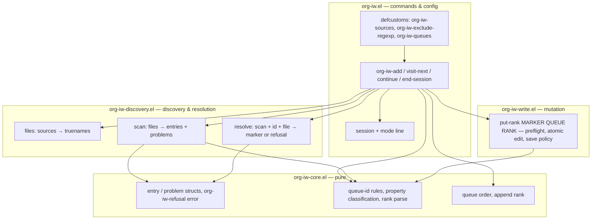

<!-- doctrine:section sec-design-problem -->
## 1. Design Problem

SL-001 builds the smallest loop the user can trial:

1. Enrol Org headings into a named queue.
2. Visit the front entry.
3. Edit it in place.
4. Send it to the back (Continue to End).
5. Repeat.

It lays down every layer ADR-003 prescribes, but each only as far as that
loop needs. Placement vocabulary (SL-002), queue view (SL-003), document
targets and batch add (SL-004), actionable diagnostics (SL-005) and
redistribution (SL-006) are out of scope. The design must not make them
harder: each later slice extends the owners named here rather than adding a
parallel path (POL-002).

The system boundary is one Emacs process working over the user's Org files.
The only persistent state is `IW_<QUEUE>` properties in those files
(ADR-001).

<!-- doctrine:section sec-a-probe -->
## 2. Current State

The repository has no code. The dev shell provides Emacs 31.1 with Org
9.8.10 and package-lint on the load path (research T2-9). Governance:
PRD-001, ADR-001 to ADR-003, POL-001 to POL-003. The Org behaviour this
design relies on was verified by probes: `research/research.md` T2-1 to
T2-12, plus the experiments behind review RV-001.

<!-- doctrine:section sec-03-forces -->
## 3. Forces & Constraints

- **ADR-001:** membership is read only from source properties. No index,
  no log, no state file.
- **ADR-002:** writes go through visiting buffers. Save a buffer that was
  clean; leave a dirty one unsaved and report it. Live buffers beat disk.
  Single writer.
- **ADR-003:** pure core ← discovery ← write ← commands. The core requires
  no Org.
- **POL-001:** zero-warning byte-compile, checkdoc and package-lint. ERT on
  Emacs 30 and 31. TDD.
- **POL-002:** one owner per concept.
- **POL-003:** the result must be trial-able, with no infrastructure ahead
  of need.
- **PRD-001 § 4:** `org-iw-` prefix; Emacs 30.1; no runtime dependencies;
  local (non-inherited) reads; exact integer ranks.

Verified Org and Emacs behaviour that shapes the design:

- `org-map-entries` skips file-level drawers (T2-5), so the scan walks
  property lines itself.
- `org-entry-properties` returns reserved `IW_AFTER_*` alongside
  memberships (T2-3). It upcases names (`IW_straße` → `IW_STRASSE`) and
  silently collapses a key that appears twice in one drawer. The scan
  therefore reads IW lines raw. Org treats a lowercase `:id:` key as the
  ID.
- `org-id-get-create` writes the global id-locations file (T2-7), so tests
  must isolate it.
- `org-find-entry-with-id` returns the *first* `:ID:` match and ignores
  case, including headings that have no memberships. It is therefore
  unfit to choose a write target.
- A modified buffer creates a `.#name.org` lock-file symlink, which
  matches `*.org` directory searches.
- In a clean buffer whose file changed on disk, `org-entry-put` prompts
  (and errors in batch). A re-visit offers to revert.
- A buffer visited through a symlink is found by `find-buffer-visiting`,
  not by `get-file-buffer` on the truename. Indirect buffers have no
  `buffer-file-name`.
- `upcase` maps some non-ASCII letters to ASCII (`ß` → `SS`).
- An indirect buffer has no `buffer-file-name`, and
  `verify-visited-file-modtime` returns t for it. File checks must use the
  base buffer.
- A shared `batch-byte-compile` process hides a missing `require`: one
  file's `require` satisfies another's call.
- Arithmetic on very large parsed integers signals `overflow-error`.

<!-- doctrine:section sec-04-principles -->
## 4. Guiding Principles

- **Plain data across layers.** Discovery turns buffers into
  `org-iw-entry` records. The core computes over records. Writes act on a
  marker obtained at write time, never on a stored position.
- **Layers take arguments, not globals.** Only `org-iw.el` reads
  `defcustom`s. Discovery and write functions take files, IDs, markers and
  queues as arguments.
- **Every command recomputes.** Every command scans afresh (DEC-003).
  Nothing is cached, so nothing can go stale.
- **One owner for each refusal.**
  - Discovery owns "which heading is this ID?" (`resolve`).
  - The write layer owns "may this buffer be written now?" (preflight).
  - Commands only let refusals surface.
  - Later slices (move, remove, batch add, redistribution) reuse both
    owners unchanged.
- **Refuse rather than guess, and refuse atomically.** Ambiguous or
  invalid state excludes the affected entry or refuses the operation. A
  refused or failed operation leaves every buffer and file as it was.
  SL-005 turns the refusal messages into actionable diagnostics.

<!-- doctrine:section sec-05-1-system-model -->
## 5. Proposed Design

### 5.1 System Model

The diagram shows file ownership and every call edge between layers.
Edges only point downwards (ADR-003, DEC-001).



Edges worth noting:

- Commands set the session. The session never calls commands.
- `put-rank` takes a marker and never resolves an ID itself. Every caller
  gets its marker from `resolve` (an existing entry) or from point (Add).
  So ID resolution has one owner, and SL-004 can pass a `point-min`
  marker for document targets without a new write path.
- Every refusal reaches the user as an `org-iw-refusal` signal, a subtype
  of `user-error`, from whichever layer raised it.

<!-- doctrine:section sec-05-2-interfaces -->
### 5.2 Interfaces & Contracts

**`org-iw-core.el`** (requires `cl-lib`, `seq`, `subr-x` only)

```elisp
(defconst org-iw-core-rank-spacing 1024)
(defconst org-iw-core-rank-limit (1- (expt 2 53)))  ; |rank| bound, both signs

(define-error 'org-iw-refusal "org-iw refused" 'user-error)

(cl-defstruct (org-iw-entry (:constructor org-iw-entry-create) (:copier nil))
  id          ; string, Org ID, compared case-sensitively
  title       ; string for display
  file        ; absolute truename
  memberships); alist (CANONICAL-QUEUE-ID . INTEGER-RANK)

(cl-defstruct (org-iw-problem (:constructor org-iw-problem-create) (:copier nil))
  type        ; symbol, see discovery
  file        ; truename
  id)         ; entry ID or nil

(org-iw-core-queue-id STRING)            ; → "ESSAYS" or nil
(org-iw-core-classify-property NAME)     ; → (member . QID) | reserved | invalid | nil
(org-iw-core-parse-rank VALUE)           ; → integer or nil
(org-iw-core-rank ENTRY QUEUE)           ; → integer or nil
(org-iw-core-queue-order ENTRIES QUEUE)  ; → members sorted by (rank, id string<)
(org-iw-core-queue-ids ENTRIES)          ; → sorted unique queue IDs present
(org-iw-core-append-rank ORDERED)        ; → 1024 if empty, else last rank + spacing;
                                         ;   nil if that would exceed the limit
```

**Queue IDs.** `org-iw-core-queue-id` checks the *raw* string against
`\`[A-Za-z0-9-]+\'` with `case-fold-search` nil, and only then upcases it.
Checking after upcasing would let `ß` through as `SS`.

**Rank parsing.** `org-iw-core-parse-rank` accepts `^[+-]?[0-9]+$` after
trimming, and rejects any value whose magnitude exceeds the limit. The
bound (2^53 − 1) keeps ranks within exact double precision, so other tools
can read them, and keeps arithmetic far from overflow. Allocation that
would cross the limit returns nil. Callers report that as "redistribution
needed", which SL-006 will provide.

**Continue to End** is `append-rank` over the ordering with the target
removed, applied only when the target isn't already last. There is no
separate end-rank function. SL-002's End placement will be this same
call.

**`org-iw-core-classify-property`**:

- The `IW_` and `AFTER_` prefixes match case-insensitively, as Org
  treats property keys.
- The queue-ID suffix is checked raw, then upcased, as queue IDs are.

So `iw_essays` is a member of `ESSAYS`, and `IW_straße` is invalid.

| Name | Result |
|---|---|
| `IW_AFTER_<anything>` | `reserved` |
| `IW_<valid id>` | `(member . ID)` |
| `IW_<anything else>`, including underscores | `invalid` |
| not `IW_…` | `nil` |

So `IW_AFTER-ESSAYS` is membership of queue `AFTER-ESSAYS` (REQ-003).

**`org-iw-discovery.el`** (requires core, `org`)

```elisp
(cl-defstruct (org-iw-scan (:copier nil)) entries problems)

(org-iw-discovery-files SOURCES EXCLUDE-REGEXP) ; → sorted, deduplicated truenames
(org-iw-discovery-scan FILES)                  ; → org-iw-scan
(org-iw-discovery-buffer FILE)                 ; → find-buffer-visiting, else find-file-noselect
(org-iw-discovery-resolve SCAN ID FILE)        ; → marker at the entry (heading, or point-min);
                                               ;   else signals org-iw-refusal
(org-iw-discovery-id-count ID)                 ; → number of ID property lines whose value
                                               ;   is exactly ID (key any case), in the
                                               ;   widened base buffer
```

*File selection.* The defcustom docstrings state these rules (REQ-005):

- A directory source is searched recursively for `*.org`.
- Below a configured root, hidden directories (names starting with `.`,
  such as `.git`) are skipped. A root that is itself hidden, such as
  `~/.notes`, still works.
- Symlinked directories are not followed. That avoids cycles, and the
  user can list the target instead.
- Names starting with `.#` (Emacs lock files) are skipped, as is anything
  that isn't a regular file after `file-truename`.
- `org-iw-exclude-regexp` is matched against the truename.
- The result is sorted and deduplicated by truename.

*Problem types:*

| Type | Meaning |
|---|---|
| `missing-id` | IW properties but no ID |
| `invalid-rank` | a rank that doesn't parse or exceeds the limit |
| `invalid-property` | an `IW_` name that isn't a valid queue ID |
| `misplaced-property` | an `:IW_…:` line that Org doesn't treat as a property, such as a drawer after `#+title` or after body text |
| `duplicate-property` | the same `IW_<Q>` twice in one drawer, compared case-insensitively |
| `duplicate-id` | an entry's ID appears on another scanned entry, or on another ID property line in the same file |
| `unreadable` | the file couldn't be read |

*`resolve`* is the only owner of ID resolution. It never uses
`org-find-entry-with-id`. It works in the base buffer, widened
(`org-with-wide-buffer`), so narrowing and indirect buffers can't hide a
copy of the ID or the target itself. It refuses, naming the ID and file,
when:

- the scan excluded ID as a duplicate;
- `id-count` is 0 ("not found");
- `id-count` is greater than 1 ("ambiguous").

Otherwise it returns a marker at `org-back-to-heading-or-point-min` from
the single match. An ID line is a line matching `^[ \t]*:ID:[ \t]+VALUE[ \t]*$`,
with the key compared case-insensitively and the value case-sensitively,
where `org-at-property-p` holds. A copy of the ID on a heading without memberships in
*another* file is invisible to the scan. It is harmless, because `resolve`
looks only in the entry's own file.

**`org-iw-write.el`** (requires core, `org`, `org-id`)

```elisp
(org-iw-write-put-rank MARKER QUEUE RANK &key EXPECTED ENSURE-ID)
;; → saved | unsaved | (save-failed . ERROR).  EXPECTED is the integer rank
;; the caller scanned, or :absent (Add).  ENSURE-ID creates an ID at MARKER
;; if missing.
```

It runs in three steps. Every step refuses by signalling `org-iw-refusal`
before anything changes.

1. **Preflight.** File checks run on the base buffer,
   `(or (buffer-base-buffer b) b)`, because an indirect buffer has no file
   of its own.
   - If `verify-visited-file-modtime` fails for the base buffer →
     "changed on disk; revert first". No prompt, no revert.
   - If its file isn't writable → "not writable".
   - If the local `IW_<Q>` at MARKER, read with the scan's raw-line reader
     and parsed with `org-iw-core-parse-rank`, doesn't equal EXPECTED →
     "changed since scan". So `007` equals 7, and a duplicated or
     accumulated key refuses. This compare-and-set guards against a stale
     scan.
2. **Atomic edit.** `atomic-change-group` around `org-id-get-create`
   (only when ENSURE-ID is set) and `org-entry-put`. If either signals,
   the text is restored. A buffer that was clean is marked unmodified
   again, and the error propagates.
3. **Save policy** (ADR-002). If the base buffer was clean before step
   2, `save-buffer` it and return `saved`; otherwise return `unsaved`.
   If `save-buffer` itself fails (a hook error, a full disk), the edit
   stands and the result is `(save-failed . ERROR)`. The command reports
   "queue change applied but not saved: <error>". Continue still
   navigates, because the edit stands.

```elisp
(defun org-iw-write--apply (marker fn)
  "Call FN at MARKER atomically; save if the base buffer was clean.
Return `saved', `unsaved' or (save-failed . ERROR)."
  (with-current-buffer (marker-buffer marker)
    (let* ((base (or (buffer-base-buffer) (current-buffer)))
           (was-clean (not (buffer-modified-p base))))
      ;; On any non-local exit the group's changes are undone, which also
      ;; restores the modified flag (verified, RV-001).
      (atomic-change-group
        (save-excursion
          (save-restriction (widen) (goto-char marker) (funcall fn))))
      (if (not was-clean)
          'unsaved
        (condition-case err
            (progn (with-current-buffer base (save-buffer)) 'saved)
          (error (cons 'save-failed err)))))))
```

Add and Continue both use this path. So will SL-003 move and remove,
SL-004 document and batch add, and SL-006 redistribution.

**`org-iw.el`** (package entry point: `Package-Requires: ((emacs "30.1"))`)

- `defcustom org-iw-sources`: a list of files and directories (rules
  above).
- `defcustom org-iw-exclude-regexp`: nil or a regexp.
- `defcustom org-iw-queues`: a list of `(QUEUE-ID . PLIST)`. SL-001 reads
  only `:name` (DEC-002).
- Commands, all autoloaded:
  - `org-iw-add` (QUEUE)
  - `org-iw-visit-next` (QUEUE; a prefix argument forces the prompt)
  - `org-iw-continue`
  - `org-iw-end-session`
- Private helpers:
  - `org-iw--files`: the file list from the defcustoms.
  - `org-iw--scan`.
  - `org-iw--queue-name`.
  - `org-iw--read-queue`.
  - `org-iw--source-file-p`: tests the truename of
    `(buffer-file-name (or (buffer-base-buffer) (current-buffer)))`, so
    indirect buffers work.
  - `org-iw--visit SCAN ENTRY QUEUE POS TOTAL`: the one navigation owner.

<!-- doctrine:section sec-05-3-data -->
### 5.3 Data, State & Ownership

**Source state** (authoritative, in the user's files):

```org
* A particular argument
:PROPERTIES:
:ID:       3f1c…
:IW_ESSAYS: 5120
:IW_AFTER_ESSAYS: <reserved; never written>
:END:
```

**Derived state:** an `org-iw-scan` for each command invocation, which is
discarded afterwards. Example:

```elisp
#s(org-iw-scan
   :entries (#s(org-iw-entry :id "3f1c…" :title "A particular argument"
                :file "/home/u/notes/essay.org"
                :memberships (("ESSAYS" . 5120))))
   :problems (#s(org-iw-problem :type invalid-rank
                 :file "/home/u/notes/x.org" :id "9a0e…")))
```

Two fields are deliberately absent (POL-003); each arrives with its first
caller:

- outline paths, for SL-003's view;
- problem positions and details, for SL-005's diagnostics.

**Session state:** the only long-lived in-memory state, owned by
`org-iw.el` (DEC-005).

```elisp
(cl-defstruct (org-iw--session (:copier nil)) queue id title)
(defvar org-iw--session nil)
```

- **Set** only by `org-iw--visit`.
- **Cleared** by `org-iw-end-session`.
- **Display.** While a session is set, `global-mode-string` contains
  `(:eval (org-iw--mode-line))`, which renders `IW[Essays: A particular
  argument]`. The queue name and title have `%` escaped as `%%`. Ending
  the session removes the entry. Nothing is persisted.

<!-- doctrine:section sec-05-4-dynamics -->
### 5.4 Lifecycle, Operations & Dynamics

**Discovery scan** (DEC-003). For each file:

1. If `find-buffer-visiting` finds a buffer, read it, widened and
   including unsaved text.
2. Otherwise, `insert-file-contents` into a temp buffer.
   - Enable `(delay-mode-hooks (org-mode))` only if a case-insensitive
     `^[ \t]*:IW_` search hits.
   - This read never visits the file.
   - A read error records an `unreadable` problem, and the scan moves on.
3. Tally ID lines (as defined for `resolve`) per value for this buffer,
   in one pass.
4. For each line matching `^[ \t]*:IW_[^:\n]*:`, case-insensitively:
   - Lines inside a block are quoted text, not metadata. Skip them
     silently. The test is
     `(org-element-lineage (org-element-at-point) org-iw-discovery--block-types t)`,
     where the types are `src-block`, `example-block`, `export-block`,
     `quote-block`, `verse-block`, `special-block`, `comment-block` and
     `dynamic-block`. The lineage is needed because inside a quote block
     `org-element-at-point` returns the inner paragraph.
   - Otherwise, if `org-at-property-p` doesn't hold →
     `misplaced-property`; skip the line.
   - Otherwise move to `org-back-to-heading-or-point-min`, and skip
     entries already collected.
   - Read the ID with `org-entry-get nil "ID"` (local; any key case). If
     there's none → `missing-id`, and skip the entry.
   - If the ID's tally from step 3 is above 1 → `duplicate-id`, and skip
     the entry. This catches a non-member copy in the same file, which
     would otherwise make `resolve` refuse and wedge the queue front.
   - Read the IW lines *raw* from `org-get-property-block`,
     case-insensitively, using
     `^[ \t]*:\(IW_[^:\n]*\):[ \t]*\(.*?\)[ \t]*$`. This keeps the
     original name case, which `org-entry-properties` would upcase. It
     reads locally and never inherits (REQ-002).
   - Classify each raw name.
     - The same name more than once, compared case-insensitively →
       `duplicate-property`, and drop that queue's membership.
     - An `IW_<Q>+` line (Org's accumulate syntax) also counts as a
       second occurrence of `IW_<Q>`, because Org would read the combined
       value.
     - An unparseable value → `invalid-rank`, and drop that membership.
     - Any other invalid name → `invalid-property`.
   - This raw-line reader, `org-iw-discovery--iw-lines`, is the *only*
     reader of IW values. Write preflight and Add step 4 use it too, so the
     scan and the write can never disagree about a value.
   - The title comes from `org-get-heading t t t t`, or for a document
     from `#+title` or the file base name.
5. After all files: any ID on more than one entry gets one `duplicate-id`
   problem, and all its entries are dropped.

**Continue to End.** The diagram shows the refusal paths and why Continue
never acts on point or on the current front entry.

```mermaid
sequenceDiagram
  actor U as User
  participant C as org-iw-continue
  participant D as discovery
  participant K as core
  participant W as write
  U->>C: M-x org-iw-continue
  C->>C: session? else refuse "no session"
  C->>D: scan(org-iw--files)
  D-->>C: entries, problems
  C->>K: queue-order(entries, queue)
  alt retained id not in order
    C-->>U: refuse: "duplicated ID" or "no longer in queue" (no write, no navigation)
  else only entry
    C-->>U: "only entry in queue" (left in place)
  else retained is already last
    C->>C: visit(first of order)
    C-->>U: "T already at end. Now 1/N: Next"
  else
    C->>K: append-rank(order minus retained)
    alt nil (limit)
      C-->>U: refuse: "rank limit; redistribution needed"
    else rank
      C->>D: resolve(scan, id, file) → marker
      C->>W: put-rank(marker, queue, rank, expected: old rank)
      W-->>C: saved | unsaved | save-failed (or refusal: stale, not writable, changed on disk)
      C->>C: visit(first of order minus retained)
      C-->>U: "Moved T to end (saved). Now 1/N: Next"
    end
  end
```

The next entry is always the head of the ordering *with the retained
entry removed*. That holds whether or not a write happened, so no second
scan is needed. It is sound because a successful write changes only the
retained entry's rank.

**Visit** (`org-iw--visit`, used by all three navigating paths):

1. `resolve` the entry against SCAN. A refusal is reported, naming the
   ID and file, and the session is left unchanged.
2. `pop-to-buffer-same-window`. If the marker lies outside the buffer's
   narrowing, widen.
3. Go to the marker, then `org-fold-reveal` and `org-fold-show-entry`.
4. Set the session and echo `IW Essays N/M: Title`.

**Visit next** (`org-iw-visit-next`):

1. The queue is the session's queue, unless there's no session or a prefix
   argument was given; then prompt.
2. Scan and order the queue. If it's empty, report "Queue Essays is empty"
   and change nothing.
3. Otherwise visit the first entry.

It doesn't narrow and doesn't change any queue state (REQ-014). Visiting
again without Continue reopens the same entry.

**Add** (heading at point). Refusals, in order:

1. The buffer isn't a source file (`org-iw--source-file-p`) → "not under
   org-iw-sources". A membership no queue could show is worse than an
   error.
2. Point is before the first heading → "document targets are not yet
   supported" (SL-004).
3. Read the queue. Completion offers configured and discovered IDs, with
   display names shown as annotations. A typed ID that fails
   `org-iw-core-queue-id` is refused.
4. Malformed drawer: `org-get-property-block` is nil, but the heading's
   own section (up to the next heading) contains a `:PROPERTIES:` line
   outside any block (the same block test as the scan).
   Refuse "heading has a property drawer Org doesn't recognise". Without
   this, `org-entry-put` would insert a second drawer.
5. The heading already has a local `IW_<Q>` according to the raw-line
   reader:
   - if the scan holds a membership in Q → "already in Essays at N/M",
     a no-op;
   - otherwise → refuse "has IW_<Q> but it is excluded (<problem type>)".
6. The heading already has an ID and either:
   - `id-count` (widened base buffer) isn't 1, or
   - a scanned entry with this ID is in another file
   → refuse "ID shared with another heading". This stops Add creating a
   duplicate that would knock an existing member out of its queue.
7. `rank = append-rank(order)`. nil → refuse "rank limit".

Then call `put-rank(marker-at-heading, queue, rank, :expected :absent,
:ensure-id t)`. Report the position `M+1/M+1` and the save status.

**Messages.**
- The save status is appended as one of:
  - "(saved)";
  - "(buffer has unsaved changes — queue change not saved)";
  - "(queue change applied but not saved: <error>)".
- If the scan found any problems, a suffix `[N source problems ignored]`
  is added. Listing them is SL-005's job.

<!-- doctrine:section sec-05-5-invariants -->
### 5.5 Invariants, Assumptions & Edge Cases

Invariants. Each has a test named after it (§ 9).

- **I1.** Visit writes nothing. No buffer's modified flag changes, except
  that a file may be opened cleanly.
- **I2.** A successful Continue changes exactly one property line in one
  file. A successful Add changes one heading's drawer: one `IW_<Q>` line,
  plus an `:ID:` line and drawer if they were missing.
- **I3.** Continue always targets the session's ID, whatever is at point
  or at the front of the queue.
- **I4.** No IW property other than `IW_<target queue>` is ever written.
  `IW_AFTER_*` and other `IW_*` lines are byte-identical afterwards.
- **I5.** Nothing is written to a file except through its buffer. Only a
  buffer that was clean before the operation is saved.
- **I6.** The core never touches buffers or Org. `org-iw-core.el` loads
  without `org`.
- **I7.** A refused operation, or one whose edit fails, leaves every
  buffer's text, modified flag and file unchanged. Two exceptions:
  - A failed *save* leaves the applied edit in place, reported as
    `save-failed`.
  - A failed Add may leave the new ID registered in org-id's location
    table, which is harmless and self-healing.
- **I8.** No file other than the user's Org files is created
  (REQ-025). Emacs's own backup files are excepted.

Verified assumptions (RV-001 experiments):

- `string-to-number` returns an exact bignum and accepts `+5` and `007`.
- `org-entry-put` rewrites only the target line, and creates a drawer
  after a planning line.
- `org-at-property-p` rejects `:IW_` lines in source blocks.
- `org-fold-reveal` works at `point-min`.

Edge cases:

- **Negative ranks** sort normally. The append rank after a last rank of
  -2048 is -1024.
- **Equal ranks** sort by ID with `string<`. That order is stable once
  duplicate IDs are excluded.
- **Session target in a killed buffer.** `org-iw-discovery-buffer` visits
  the file again.
- **Session target deleted** → "no longer in queue", and no write.
- **File edited externally after the scan.** Preflight refuses; the user
  reverts and retries.

<!-- doctrine:section sec-06-open -->
## 6. Open Questions & Unknowns

- DEC-003 (rescan) and DEC-004 (keep buffers) are provisional until SL-004
  re-measures at journal scale.
- Behaviour on Emacs 30 can only be shown by the user's `make test-all`
  (DEC-006). This is a closure prerequisite, not a design question.

<!-- doctrine:section sec-07-decisions -->
## 7. Decisions, Rationale & Alternatives

Durable decisions from the design run (read with `doctrine show DEC-00N`;
accepted when the design locks):

- DEC-001: module layout, one file per ADR-003 layer.
- DEC-002: `org-iw-queues` is an alist of `(ID . PLIST)`, open to SL-002
  keys.
- DEC-003: rescan on every operation with a raw-text prefilter; no cache.
- DEC-004: buffers opened only to write stay open.
- DEC-005: session held in memory and shown in the mode line; no
  persistence.
- DEC-006: Emacs 30 test binary from a pinned `nixos-26.05` input.

Local choices, not durable:

- **Own ID resolver instead of `org-find-entry-with-id`.** That function
  returns the first match and ignores case, so it can choose the wrong
  heading.
- **Marker-based write API plus compare-and-set.** There is one write path
  for every current and planned operation, and a stale scan can never
  overwrite a newer value.
- **Refusals are an error type** (`org-iw-refusal`, a subtype of
  `user-error`), not return codes. Every layer refuses the same way, tests
  can tell a refusal from a bug, and the command loop shows the message
  without a backtrace.
- **Rank limit 2^53 − 1.** Ranks stay exact in any JSON or float reader,
  and overflow is structurally impossible.
- **Raw IW line reads** instead of `org-entry-properties`. They keep the
  name's case, see duplicate keys, and are cheaper.
- **Plain structs** for entries and problems give typed accessors, and
  byte-compile catches misspelt field names.
- **Add refuses files outside sources.**
- **Continue's navigation target is computed, not rescanned.**

<!-- doctrine:section sec-08-risks -->
## 8. Risks & Mitigations

- **The user's save hooks run on auto-save.** Clean buffers are saved with
  `save-buffer`, so hooks such as whitespace cleanup can change other
  lines.
  - Accepted as ordinary Emacs behaviour (ADR-002).
  - The human trial checks `git diff` on the user's own config.
- **Scan cost with many members.** With every one of 1,840 headings a
  member, a scan takes 0.65 s, about 0.33 ms per membership read (research
  T2-6, re-measured).
  - The scan now reads IW lines raw instead of calling
    `org-entry-properties` (§ 5.4), which removes the dominant cost.
    SL-004 measures the result on a real journal.
- **Emacs 30 drift.** The agent can't run 30.2.
  - Byte-compile and package-lint against `(emacs "30.1")`, and the user
    runs `make test-all` before close.
- **Tests touching global org-id state.**
  - The fixture binds `org-id-locations-file`, `org-id-locations` and
    `org-id-track-globally`.

<!-- doctrine:section sec-09-quality -->
## 9. Quality Engineering & Validation

**Tooling** (DEC-006, POL-001). The `Makefile` defines:

- `EMACS ?= emacs` and `EMACS30 ?= emacs-30`.
- `compile`: byte-compile each source and test file in its *own*
  `emacs -Q --batch` process, so a missing `require` can't be masked by
  another file. `byte-compile-error-on-warn` is set, and
  `byte-compile-dest-file-function` points into a temp directory. No
  `.elc` ever lands in the tree, even when compilation fails.
- `checkdoc`: `tools/checkdoc-batch.el` runs checkdoc over the source and
  test files and exits non-zero if there are any diagnostics. (Plain
  `checkdoc-file` exits 0 on warnings.)
- `package-lint`: source files only, with `package-lint-main-file` set to
  `org-iw.el`.
- `lint`: `compile`, `checkdoc` and `package-lint`.
- `test`: ERT batch run of `test/*-test.el` from source (`-L . -L test`,
  `load-prefer-newer` t).
- `test-all`: `test` under both `EMACS` and `EMACS30`.

`.gitignore` gains `*.elc`. `flake.nix` gains the `nixpkgs-emacs30` input
and the `emacs-30` wrapper.

**Test fixture** (`test/org-iw-test-helpers.el`, the one fixture owner):

```elisp
(org-iw-test-with-corpus (("a.org" . "* H1\n:PROPERTIES:\n:ID: a1\n:IW_ESSAYS: 1024\n:END:\n")
                          ("b.org" . "..."))
  BODY)
```

It creates a temp directory with the given files and binds:

- `org-iw-sources` to that directory, `org-iw-queues` to nil;
- `org-id-locations-file` to a temp file outside the corpus,
  `org-id-locations` to nil, `org-id-track-globally` to nil.

Afterwards it discards modifications, kills every buffer visiting the
directory (which releases `.#` lock files), then asserts I8: the listing
is unchanged apart from `*~`. Finally it deletes the directory. It also
provides:

- `org-iw-test-file-string`: the file's contents on disk;
- `org-iw-test-visit`: open a buffer on a corpus file;
- `org-iw-test-changed-lines`: the diff between two strings, used for I2
  and I4.

**Key test cases**, named by behaviour.

*Core (`org-iw-core-test.el`):*
- I6, in two layers. The per-file `compile` catches calls to undefined
  Org functions. A test runs the core suite in a child
  `emacs -Q --batch` and asserts `(featurep 'org)` is nil afterwards;
- queue ID canonicalises case; rejects the empty string, underscores,
  spaces and `straße`;
- property classification covers member, `IW_AFTER_` reserved,
  `IW_AFTER-X` as a member, invalid names, `IW_straße`, and non-IW names;
- rank parsing covers negative ranks, `+5` and `007`; rejects `1.5`,
  `soon`, the empty string, `1e3` and values beyond the limit;
- queue order sorts by rank, breaks ties by ID, and returns only members;
- append rank: 1024 for an empty queue, `last + 1024` otherwise, correct
  after a negative last rank, nil at the limit.

*Discovery (`org-iw-discovery-test.el`):*
- a heading membership is not inherited by its children;
- a document drawer is read;
- a live buffer's unsaved rank beats disk, including a buffer visited via
  a symlink;
- an unvisited file is read without creating a buffer;
- a `.#` lock file from a modified buffer is ignored;
- hidden directories and symlinked directories are skipped;
- files are deduplicated via overlapping sources;
- the exclude regexp is honoured;
- each problem type is produced, with the membership or entry excluded:
  - missing ID;
  - invalid rank;
  - invalid property, including `IW_straße` and `IW_ESSAYS+`;
  - misplaced property (`#+title` before the drawer, drawer after body);
  - duplicate property, including `IW_ESSAYS` with `iw_essays`;
  - duplicate ID across files, and with a non-member copy in the same file;
  - unreadable file;
- `:IW_` lines inside source, example, quote, special and dynamic blocks
  produce no problem;
- `iw_essays` (lowercase prefix) is a member of `ESSAYS`;
- `IW_ESSAYS` with `IW_ESSAYS+` is a `duplicate-property`;
- `IW_AFTER_` is not a membership;
- resolve finds a unique ID in a visited and an unvisited file;
- resolve refuses: not found, a non-member heading sharing the ID in the
  same file, a case-variant ID value only, a duplicate excluded by the
  scan;
- resolve counts a lowercase `:id:` key;
- resolve finds the target and its copies in a narrowed buffer.

*Write (`org-iw-write-test.el`):*
- put-rank changes only the target line, and other `IW_*` and `IW_AFTER_*`
  lines stay identical (I4);
- a clean buffer is saved (status `saved`, disk updated);
- a dirty buffer is left modified (status `unsaved`, disk unchanged) (I5);
- put-rank refuses a stale expected value, a buffer changed on disk
  (also via an indirect buffer), and an unwritable file, leaving
  everything unchanged (I7);
- a failing `before-save-hook` yields `save-failed` with the edit applied;
- an error inside the edit restores text and modified flag (I7);
- ensure-id adds one ID;
- undo restores the previous rank.

*Commands (`org-iw-test.el`):*
- add appends and changes only that heading's drawer (I2, I4);
- adding an existing membership is a no-op;
- add refuses: outside sources, before the first heading, an invalid typed
  queue ID, an excluded local property, a shared ID, a malformed drawer;
- add works from an indirect buffer and a narrowed buffer;
- visit-next modifies nothing, and repeating it opens the same entry (I1);
- a prefix argument prompts for the queue;
- visit-next in a narrowed buffer widens to reach the entry;
- continue changes one line in one file (I2);
- continue targets the retained entry after point moves to another entry
  (I3);
- continue survives the queue front being edited in another file;
- continue after the visited entry was edited and left unsaved in a
  directory source: the scan still works, the change is reported unsaved,
  and the disk is unchanged (I5, lock file);
- continue on the only entry leaves it in place;
- continue on a removed or duplicated target makes no write and no
  navigation;
- continue when already last makes no write and opens the next entry, with
  the "already at end" message;
- the problems suffix appears when the scan has problems;
- the mode line shows the session with `%` escaped, and end-session clears
  it.

**Human trial (VH, POL-003)** on a Git-committed copy of real notes. Load
with `(add-to-list 'load-path "/path/to/org-incremental-writing")` and
`(require 'org-iw)`, then set `org-iw-sources` and `org-iw-queues`.

1. Configure one queue. Add three headings across two files.
2. Visit next, edit the visited entry and save, then Continue. `git diff`
   shows your edit plus exactly one changed `IW_` line.
3. Continue through a full cycle. Each Continue changes one line.
4. Edit a visited entry *without* saving, then Continue. You get the "not
   saved" message and the file on disk is unchanged.

Also required: `make test-all` passes on Emacs 30.2 and 31.1.

<!-- doctrine:section sec-10-code-impact -->
## 10. Code Impact

| Path | Change |
|---|---|
| `org-iw-core.el` | new: structs, refusal error, queue-ID and property rules, rank parse and limit, ordering, append rank |
| `org-iw-discovery.el` | new: file selection, scan and problems, buffer lookup, ID count, resolve |
| `org-iw-write.el` | new: put-rank (preflight, atomic edit, save policy) |
| `org-iw.el` | new: package header, defcustoms, session and mode line, visit, four commands |
| `test/org-iw-test-helpers.el` | new: corpus fixture, org-id isolation, I8 check, line-diff helper |
| `test/org-iw-core-test.el`, `test/org-iw-discovery-test.el`, `test/org-iw-write-test.el`, `test/org-iw-test.el` | new: suites per § 9 |
| `tools/checkdoc-batch.el` | new: checkdoc runner that fails on diagnostics |
| `Makefile` | new: compile, checkdoc, package-lint, lint, test, test-all |
| `.gitignore` | add `*.elc` |
| `flake.nix` | add the `nixpkgs-emacs30` input and the `emacs-30` wrapper in `projectPkgs` |

