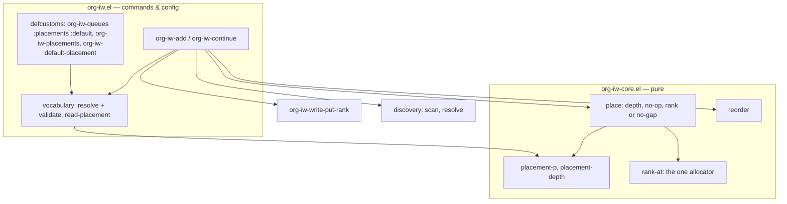

<!-- doctrine:section sec-01-problem -->
## 1. Design Problem

SL-001's Continue always sends the retained entry to the end. SL-002 turns
it into the reinsertion interaction PRD-001 describes:

- place an entry at a fixed depth, a fraction of the way back, or the end
  (REQ-009);
- write one rank between the new neighbours, nothing when the order would
  not change, and refuse before any change when no integer gap is left
  (REQ-010, ADR-004);
- name those placements per queue, with Soon / Later / End for queues that
  configure nothing (REQ-016);
- offer a default Continue and a chooser, with clear messages for the
  empty, sole-entry and missing-target cases (REQ-015);
- let Add enrol at a chosen placement (REQ-011).

Out of scope: the queue view, move and remove (SL-003), including Remove
as a Continue choice; document targets (SL-004); redistribution (SL-006),
which SL-002 only refuses toward; the interactive double scan (IMP-002,
SL-004).

<!-- doctrine:section sec-02-current -->
## 2. Current State

SL-001 is done (158 tests on Emacs 30.2 and 31.1). The parts SL-002
changes (research.md, Thread 2):

- `org-iw-core-append-rank ORDERED QUEUE` (`org-iw-core.el`) is the only
  allocator. The command wrapper `org-iw--append-rank` turns nil into the
  refusal "rank limit; redistribution needed". Add and
  `org-iw--move-to-end` call it.
- `org-iw-continue` removes the retained entry from the order, skips the
  write when the entry is already last, and visits the head of the rest.
- `org-iw-queues` is an alist of `(QUEUE-ID . PLIST)`. Only `:name` is
  read, by `org-iw--configured-name`. DEC-002 kept the plist open for this
  slice.
- With a session, an empty queue reaches `org-iw--refuse-absent` ("no
  longer in queue"). REQ-015 asks for "empty".

Discovery (`org-iw-discovery.el`) and the write path (`org-iw-write.el`)
need no behavioural change: `org-iw-write-put-rank` already writes any valid rank with
a compare-and-set on the scanned value.

<!-- doctrine:section sec-03-forces -->
## 3. Forces & Constraints

- **ADR-004:** sparse exact integer ranks at spacing 1024 (DEC-010).
  Allocation: empty → spacing; after the last → last + spacing; before the
  first → first − spacing; between `L < R` → `floor((L + R) / 2)` only if
  strictly between. Only the target is written. No change in relative
  order → no write. No allowed rank (adjacent or tied neighbours, or the
  limit) → stop before any change and say redistribution is needed. The
  core owns all of this.
- **ADR-003 / REV-002:** placement and depth arithmetic are core.
  Commands own only their own preconditions: session, typed input and,
  here, the queue's configured vocabulary.
- **ADR-002:** writes through `org-iw-write-put-rank` only, under the save
  policy.
- **POL-002:** append is one case of the new allocator. `append-rank` and
  its wrapper are deleted in the same change.
- **STD-001:** spacing, limit and the standard vocabulary are pinned as
  literals. Every new refusal is killed by a test. A test that reaches a
  prompt binds the reader and asserts it was called.
- **STD-004:** every refusal goes through `org-iw-core-refuse`; core
  stays pure.
- **DEC-007:** placement forms, with exact integer fractions and a percent
  shorthand.
- **DEC-008:** `:placements` and `:default` on `org-iw-queues`; the
  defcustoms `org-iw-placements` and `org-iw-default-placement` for the
  rest.
- **DEC-009:** Soon `(after 2)`, Later `(fraction 1 2)`, End `end`;
  default End.
- **DEC-011:** a prefix argument opens the chooser (`completing-read`) for
  Continue and for Add.

Verified facts this design relies on (research.md):

- `(floor (* 0.29 100))` is 28 in Emacs 31.1, which is why DEC-007 uses
  integer fractions.
- In batch, a prompt blocks on stdin (mem.fact.emacs.batch-test-gotchas).
- Repeating one fixed placement every Continue exhausts its gap after 11
  uses at spacing 1024, whatever the queue size. Tail rotation never
  does. (Simulation in notes.md, triage evidence.)

<!-- doctrine:section sec-04-principles -->
## 4. Guiding Principles

- **One allocator, one placement rule.** Every rank SL-002 writes comes
  from `org-iw-core-rank-at`. Every placement decision (depth, no-op,
  no gap) comes from `org-iw-core-place`. Add, Continue and, later,
  SL-003's move and SL-006's pending placement call the same two
  functions.
- **Labels are configuration; placements are data.** A label exists only
  in Elisp config and in messages. The core sees only the placement form.
- **Refuse config on use.** The vocabulary is validated where it is read,
  before any prompt, scan or write. No validation runs at load time.
  IMP-004 owns diagnosing bad config keys in general.
- **No special cases where a rule will do.** "Already last" is the general
  "already at that depth" no-op. "Front" is `(after 0)`. Append is depth =
  count.

<!-- doctrine:section sec-05-1-system-model -->
## 5. Proposed Design

### 5.1 System Model

The layering is SL-001's. SL-002 changes only the core and the command
layer; discovery and write have no behavioural change (one docstring in
write, § 10).



- Commands never compute a depth, a rank or a neighbour. They pass the
  scanned order, the target entry and a placement form to `place`, and
  act on its answer.
- `rank-at` replaces `append-rank`. Add's plain append is `rank-at` at
  depth = count. No other function computes a rank (ADR-004 § 6).

<!-- doctrine:section sec-05-2-interfaces -->
### 5.2 Interfaces & Contracts

**`org-iw-core.el`: added**

```elisp
(org-iw-core-placement-p OBJECT)
;; → non-nil if OBJECT is a placement (DEC-007):
;;   (after N)            N a natural number
;;   (fraction NUM DEN)   natural numbers, 0 < DEN, NUM <= DEN
;;   (percent P)          natural number P <= 100
;;   end

(org-iw-core-placement-depth PLACEMENT COUNT)
;; → how many of COUNT other members precede the target, in [0, COUNT]:
;;   after → (min N COUNT); fraction → (floor (* COUNT NUM) DEN);
;;   percent → depth of (fraction P 100); end → COUNT.
;; Integer arithmetic only.  An invalid PLACEMENT is a wrong-type-argument
;; (callers validate config first), not a refusal.

(org-iw-core-rank-at OTHERS QUEUE DEPTH)
;; OTHERS: members of QUEUE in queue order, target excluded.
;; → the rank that puts a member at DEPTH among OTHERS, or nil:
;;   OTHERS empty      → org-iw-core-rank-spacing
;;   DEPTH = length    → last + spacing
;;   DEPTH = 0         → first − spacing
;;   otherwise L, R = ranks at DEPTH−1, DEPTH → (floor (+ L R) 2) if L < it < R
;;   nil when no such integer exists or the result fails org-iw-core-rank-p.

(org-iw-core-place ORDER TARGET QUEUE PLACEMENT)
;; ORDER: members of QUEUE in queue order.  TARGET: an element of ORDER
;; (compared with eq), or nil for an entry joining QUEUE.
;; → (unchanged DEPTH)   TARGET is already at DEPTH: write nothing
;;   (moved DEPTH RANK)  write RANK to TARGET
;;   (no-gap DEPTH)      no allowed rank: write nothing, redistribution needed
;; DEPTH is placement-depth over ORDER without TARGET.  A nil TARGET is
;; never unchanged.

(org-iw-core-reorder ORDER TARGET DEPTH)
;; → ORDER with TARGET moved to DEPTH among the others (a new list).
```

`moved` always changes the rank. If TARGET sits at index i ≠ DEPTH, its
rank is ≤ L (i < DEPTH) or ≥ R (i > DEPTH), and the new rank is strictly
between them.

**`org-iw-core.el`: deleted.** `org-iw-core-append-rank` (POL-002).

**`org-iw.el`: options**

```elisp
(defconst org-iw--placement-type
  '(choice (list :tag "After N others" (const after) natnum)
           (list :tag "Fraction" (const fraction) natnum natnum)
           (list :tag "Percent" (const percent) natnum)
           (const :tag "End" end))
  "Customize type of one placement.")

(defcustom org-iw-placements
  '(("Soon" (after 2)) ("Later" (fraction 1 2)) ("End" end))
  "Placements for queues that do not configure :placements. ..."
  :type `(repeat (list (string :tag "Label") ,org-iw--placement-type)))

(defcustom org-iw-default-placement "End"
  "Label of the default placement for queues without :default. ..."
  :type '(choice (const :tag "First placement" nil) string))
```

`org-iw-queues` gains the plist options `:placements` (the same type as
`org-iw-placements`) and `:default` (a label string). Its docstring
describes both.

**`org-iw.el`: vocabulary** (private helpers, the one owner of reading
placements from config)

```elisp
(org-iw--queue-config QUEUE)
;; QUEUE canonical.  → its plist in org-iw-queues, or nil.  The one reader
;; of a queue's configuration (RV-003 F-6): org-iw--configured-name becomes
;; (plist-get (org-iw--queue-config QUEUE) :name), and the vocabulary
;; reads :placements and :default through it.

(org-iw--vocabulary QUEUE)
;; QUEUE canonical.  → (DEFAULT-LABEL . PLACEMENTS), PLACEMENTS an alist
;; (LABEL PLACEMENT) in configured order.
;;   PLACEMENTS = the queue's :placements if the key is present
;;   (plist-member), else org-iw-placements.
;;   DEFAULT = the queue's :default; else, unless the queue has its own
;;   :placements, org-iw-default-placement; else the first label.
;; Refuses unless PLACEMENTS is a non-empty list of (LABEL PLACEMENT) with
;; distinct non-empty string labels and org-iw-core-placement-p
;; placements, and DEFAULT is one of the labels.  A present but nil
;; :placements is refused as empty, not treated as absent.  Each refusal
;; names the source it blames: "queue NAME :placements: …" or
;; "org-iw-placements: …", "queue NAME :default: …" or
;; "org-iw-default-placement: …" (RV-003 F-6).

(org-iw--placement QUEUE LABEL)
;; → LABEL's placement in QUEUE's vocabulary, or the default's when LABEL
;;   is nil; refuses "queue NAME has no placement \"LABEL\"".
;; → (LABEL . PLACEMENT), so messages can name the label.

(org-iw--read-placement QUEUE)
;; completing-read "Placement: " over the labels, REQUIRE-MATCH t, in
;; configured order (a completion table whose metadata sets
;; display-sort-function and cycle-sort-function to identity), default
;; the default label.
;; → the label.  Add's prompt uses it too, so its default is the queue's
;; default label, while Add without a prefix argument always appends
;; (DEC-011 as amended, RV-003 F-5).  It resolves the vocabulary before
;; prompting, so bad config refuses before the prompt.
;; Completion UIs that bubble the default to the top (icomplete, fido,
;; vertico) show it first and the other labels in configured order.  That
;; is the accepted reading of REQ-016's configured-order criterion, so
;; that RET always chooses the default (RV-003 F-1, user ruling).
```

**`org-iw.el`: commands**

```elisp
(org-iw-add QUEUE &optional LABEL)
;; LABEL nil → append (placement end).  Interactively, with a prefix
;; argument, LABEL is read with org-iw--read-placement after the queue.
(org-iw-continue &optional LABEL)
;; LABEL nil → the queue's default.  Interactively, with a prefix
;; argument, LABEL is read with org-iw--read-placement.
```

Private helpers:

- `org-iw--session-or-refuse` → the session, or refuses "no session; run
  org-iw-visit-next first". The interactive spec and the body of Continue
  both call it, so the refusal comes before the prompt.
- `org-iw--refuse-no-room WHERE NAME` → refuses "no room at WHERE in
  NAME; redistribution is not yet available — choose another placement".
  WHERE is the label, or "the end" for a plain Add, where the advice
  still holds through `C-u`. It replaces `org-iw--append-rank` and is the
  one owner of that refusal.
- `org-iw--put-rank SCAN ENTRY QUEUE RANK` resolves ENTRY and writes RANK
  with `:expected` its scanned rank. It replaces `org-iw--move-to-end`.

<!-- doctrine:section sec-05-3-data -->
### 5.3 Data, State & Ownership

**Source state:** unchanged. One `IW_<Q>` rank per membership (ADR-001).
Labels are never stored, so renaming a label or a queue's display name
touches no entry (REQ-016).

**Configuration** (DEC-008):

```elisp
(setq org-iw-queues
      '(("ARTICLES" :name "Articles"
         :placements (("Soon" (after 2))
                      ("Later" (fraction 1 2))
                      ("End" end))
         :default "Soon")
        ("TWEETS" :name "Tweets"
         :placements (("Another pass" (after 5))
                      ("Later" (percent 75))))))   ; default: first
;; Unconfigured queues, and configured ones without :placements, use
;; org-iw-placements, defaulting to org-iw-default-placement ("End").
```

**Derived state:** the scan, as in SL-001. `place` results are returned
and discarded within the command.

**Session state:** unchanged (DEC-005). Continue sets it only through
`org-iw--visit` (on `unchanged` and `moved`). Every refusal and report
leaves it as it was.

<!-- doctrine:section sec-05-4-dynamics -->
### 5.4 Lifecycle, Operations & Dynamics

**Continue** (`org-iw-continue &optional LABEL`). Checks, in order. Each
one stops the command:

1. No session → refuse "no session; run org-iw-visit-next first". The
   interactive spec checks this before prompting.
2. Placement: `org-iw--placement QUEUE LABEL`. Refuses bad config or an
   unknown label before any scan.
3. Scan; order the session's queue.
4. Order empty → report "Queue NAME is empty". No write, no navigation,
   session kept.
5. Retained ID not in the order → `org-iw--refuse-absent`, unchanged
   ("ID X is duplicated; T not moved" or "T is no longer in queue NAME").
6. Retained entry is the only member → report "T is the only entry in
   queue NAME" (as today).
7. `(org-iw-core-place order retained queue placement)`:
   - `(no-gap D)` → `org-iw--refuse-no-room LABEL NAME`. No write, no
     navigation.
   - `(unchanged D)` → no write. Visit the head of `order`.
     Report "T already at LABEL, D+1/N. Now 1/N: NEXT".
   - `(moved D RANK)` → `org-iw--put-rank`. Visit the head of
     `(org-iw-core-reorder order retained D)`. Report "Moved T to LABEL,
     D+1/N STATUS. Now 1/N: NEXT".

N is the queue length, and T and NEXT are scanned titles. At depth 0 the
head is T itself, so Continue reopens the same entry, as REQ-009 intends.
The write changes only T's rank, so the reordered list is the queue the
next scan would produce. No second scan is needed, as in SL-001.

```mermaid
sequenceDiagram
  actor U as User
  participant C as org-iw-continue
  participant K as core
  participant W as write
  U->>C: C-u M-x org-iw-continue
  C->>C: session-or-refuse
  C->>U: completing-read Placement (default End)
  U-->>C: "Soon"
  C->>C: placement(queue, "Soon") → (after 2)
  C->>C: scan, order; empty / absent / sole checks
  C->>K: place(order, retained, queue, (after 2))
  alt no-gap
    C-->>U: refuse "no room at Soon in Articles; …"
  else unchanged
    C->>C: visit head of order
  else moved D RANK
    C->>W: put-rank(marker, queue, RANK, expected: old)
    C->>K: reorder(order, retained, D)
    C->>C: visit head
  end
```

**Add** (`org-iw-add QUEUE &optional LABEL`). After `org-iw--add-target`
and `org-iw--queue-id`, and **before the scan**, the placement is resolved:
`end` when LABEL is nil, else `org-iw--placement`. So a bad label or bad
config refuses even for an existing member, as Continue does (RV-003 F-2).
SL-001's steps 5 and 6 (the existing-member no-op, the excluded and
shared-ID refusals) are unchanged. Step 7 becomes:

- `(org-iw-core-place order nil queue placement)`:
  - `(no-gap D)` → `org-iw--refuse-no-room` (WHERE "the end" for a plain
    Add, else the label).
  - `(moved D RANK)` → put-rank as today. Report "Added to NAME at
    D+1/N+1 STATUS" for a plain Add (as today), or "Added to NAME at
    LABEL, D+1/N+1 STATUS".

The interactive spec reads the queue as today. With a prefix argument it
then canonicalises the queue (`org-iw--queue-id`) and reads the placement.

<!-- doctrine:section sec-05-5-invariants -->
### 5.5 Invariants, Assumptions & Edge Cases

SL-001's I1 to I8 stand. I2 is restated, and two invariants are added:

- **I2′.** A successful Continue or Add writes at most one `IW_<Q>` line,
  in one file (plus the ID and drawer on enrolment). An `unchanged`
  Continue writes nothing: every buffer's text and modified flag, and
  every file, are as before.
- **I9.** A `no-gap` placement changes nothing and navigates nowhere. The
  session is unchanged.
- **I10.** Every rank written comes from `org-iw-core-rank-at`, and every
  placement decision from `org-iw-core-place`. No other function computes
  a rank, a depth or a neighbour.

Core property (tested over random inputs, § 9). For any order and any
placement, `place` returns one of:

- `unchanged`, when `reorder` equals ORDER;
- `moved`, when sorting the order with the target re-ranked to RANK
  equals `reorder` (ties included);
- `no-gap`, when the neighbours' ranks admit no integer strictly between
  them, or the limit is reached.

Edge cases:

- **Clamping.** `(after 10)` with 3 others → depth 3 (the end).
  `(fraction 1 1)` = end. `(percent 0)` = front.
- **Tied neighbours** (equal ranks from hand edits) → `no-gap` if the
  target must go between them. The brief routes this to redistribution.
- **Negative ranks** behave normally: between −2048 and −1024 → −1536.
  `floor` on the negative sum rounds toward −∞ and stays strictly inside
  the gap.
- **Limit.** Front below −limit or end above +limit → `no-gap`.
- **Default label missing after editing config** → refused on use, naming
  the source it blames (the queue's `:default` or
  `org-iw-default-placement`), before any scan.
- **`(fraction 0 1)` and `(after 0)`** both mean the front.
- **Small queues** (RV-003 F-8, accepted by the user). Fractions floor over
  the *others*, so Later `(fraction 1 2)` in a 2-entry queue is depth 0:
  it reopens the same entry, as REQ-009's depth-zero rule allows. In 3- and
  4-entry queues Later comes back strictly before Soon; from 5 entries
  they coincide or Later falls behind. This follows from
  REQ-009 and DEC-009, and a test pins it.

<!-- doctrine:section sec-06-open -->
## 6. Open Questions & Unknowns

- Revisit DEC-009 (default End) once SL-006 makes exhaustion recoverable.
  The user may prefer Soon then.
- ISS-001 (put-rank and Continue docstrings omit preflight refusals).
  Continue's docstring is rewritten here, so its half is fixed in passing.
  put-rank's half stays open.

<!-- doctrine:section sec-07-decisions -->
## 7. Decisions, Rationale & Alternatives

Durable (read with `doctrine show DEC-0NN`):

- DEC-007: placement forms `(after N)`, `(fraction NUM DEN)`,
  `(percent P)`, `end`; exact integer depth.
- DEC-008: `:placements` and `:default` on `org-iw-queues`; defcustoms
  `org-iw-placements` and `org-iw-default-placement`.
- DEC-009: standard Soon / Later / End, default End. Settles PRD-001 OQ-3.
- DEC-010: spacing stays 1024.
- DEC-011: a prefix argument and `completing-read` select the placement,
  for Continue and Add. As amended: Add's prompt defaults to the queue's
  default label (RV-003 F-5). The default is passed as the
  `completing-read` default, so it may be listed first (RV-003 F-1).

Local choices:

- **`place` returns a tagged list, not a struct.** Three outcomes with at
  most two fields read naturally with `pcase`. A struct would add an
  accessor family with one caller each.
- **`reorder` is separate from `place`.** Add has no target entry to
  insert, and only Continue (and later SL-003's view) needs the new order.
- **Validate config on use, not at load.** The user can fix config and
  retry without reloading, and IMP-004 owns load-time diagnostics.
- **Continue's placement is resolved before the scan.** Bad config fails
  fast and cheaply, with nothing changed.
- **Unknown label from Lisp is a refusal**, not a wrong-type error. It is
  user-facing input, typed or bound in a keymap lambda.

<!-- doctrine:section sec-08-risks -->
## 8. Risks & Mitigations

- **Hot-spot exhaustion.** Repeating Soon or Later exhausts a gap in about
  11 uses (triage evidence), and SL-006 is two slices away.
  - The default is End (DEC-009), so the common path never exhausts.
  - The refusal says what to do: choose another placement.
  - The human trial exercises it deliberately (§ 9).
- **Chooser order under completion UIs.** Some frameworks re-sort
  candidates. icomplete, fido and vertico also move the default to the top
  (RV-003 F-1, checked in `icomplete--sorted-completions`, Emacs 31.1).
  - The table's metadata sets `display-sort-function` and
    `cycle-sort-function` to `identity`, so the other labels keep
    configured order. icomplete and fido sort through
    `cycle-sort-function` in `completion-all-sorted-completions`, so the
    display key alone is not enough (RV-004 F-18).
  - Showing the default first is accepted (user ruling, DEC-011).
  - The trial checks it with the user's own completion UI.
- **Prompts in batch tests block** (mem.fact.emacs.batch-test-gotchas).
  - Tests use the existing recorder, `org-iw-cmd-test--with-prompt`,
    which asserts its arguments and returns a label.
  - Suites run with `</dev/null`.

<!-- doctrine:section sec-09-quality -->
## 9. Quality Engineering & Validation

Gates as in SL-001 (POL-001): `just check` per commit and `just gate`
(lint plus `test-all` on 30.2 and 31.1) at phase end. STD-001 adds
`just test-each`, and the mutation harness of RV-002 (until CHR-001):
every new guard or refusal is killed or its survivor justified.

**Core (`test/org-iw-core-test.el`).** Replaces the append-rank tests.

- `placement-p`: accepts each form, including the bounds `(after 0)`,
  `(fraction 0 1)`, `(fraction 1 1)`, `(percent 0)` and `(percent 100)`.
  Rejects `(after -1)`, `(after 1.5)`, `(fraction 1 0)`, `(fraction 3 2)`,
  `(fraction 0.5 1)`, `(percent 101)`, `soon`, `(end)`, and extra
  elements.
- `placement-depth`, as a table:
  - REQ-009's acceptance criteria: `(after 2)` with 5 others → 2;
    `(fraction 1 2)` with 5 → 2; `(after 10)` with 3 → 3; `(after 0)` →
    0;
  - `(percent 29)` with 100 → 29 (the float misround case); `(fraction 1
    3)` with 3 → 1; `end` with 0 → 0.
- `rank-at`, one test per ADR-004 case:
  - empty → 1024 (literal);
  - front → first − 1024;
  - end → last + 1024;
  - between 3072 and 4096 → 3584 (REQ-010);
  - adjacent 5 and 6 → nil;
  - tied 7 and 7 → nil;
  - negatives −2048 and −1024 → −1536;
  - the limit at each end → nil.
- `place`:
  - unchanged when the target is already at depth, including the last
    entry with `end` and the first with `(after 0)`;
  - moved, with the depth and the rank;
  - no-gap;
  - a nil target is never unchanged.
- `reorder`: front, middle and end.
- **Property test** (seeded, about 500 cases, no external library). The
  generator draws:
  - random orders, including tied, adjacent and negative ranks and ranks
    within a spacing of ±limit;
  - random targets, nil included;
  - random placements.

  The checker asserts the § 5.5 property **in both directions** for each
  outcome, in precedence order (RV-003 F-4):
  - `unchanged` ⇔ TARGET is non-nil and `reorder` equals ORDER;
  - `no-gap` ⇔ not `unchanged`, and no allowed rank exists at the depth
    (the neighbours admit no integer strictly between them, or the limit
    is reached). For example, A(5) T(5) B(6) with `(after 1)` is
    `unchanged`, not `no-gap`;
  - otherwise `moved`: re-sorting by `org-iw-core-queue-order`, with the
    target re-ranked to RANK, equals `reorder`.

  A nil TARGET is checked by standing in a fresh entry, with a unique ID
  and no rank in ORDER, which is inserted at DEPTH.

  A self-test (STD-001 item 2) feeds the checker deliberately wrong
  results and shows that it rejects each one:
  - always `unchanged`;
  - depth off by one;
  - `no-gap` reported for a real gap;
  - `no-gap` reported for an entry already in place.
- Literals (STD-001 item 4): spacing 1024 and limit 2^53 − 1 stay pinned.

**Commands (`test/org-iw-test.el`).**

- Continue with each standard placement on an unconfigured queue of 8
  (7 others, so the labels are told apart; RV-003 F-3):
  - the resulting order (Soon → 3rd, Later → 4th, End → 8th);
  - exactly one changed line (I2′);
  - the next entry visited, and the message.
- A configured queue:
  - the chooser offers its labels in configured order, with its default
    (`org-iw-cmd-test--with-prompt`; STD-001 item 6);
  - `:default` absent → the first label;
  - a queue with only `:default` uses the standard placements.
- `C-u` Continue reads a placement; Continue without a prefix doesn't
  prompt (the recorder asserts it was not called).
- Refuse before prompting (RV-003 F-7). The recorder fails the test if it
  is reached:
  - `C-u` Continue without a session;
  - `C-u` Continue with bad config;
  - `C-u` Add with bad config, after the queue prompt but before the
    placement prompt.
- `C-u` Add's prompt default is the queue's default label (DEC-011).
- `(org-iw-continue "Soon")` from Lisp; an unknown label refuses with
  nothing changed.
- Bad config refuses before any scan or write, naming the source it
  blames: an invalid placement, a duplicate label, an empty or
  present-but-nil list, a missing default. At least one case blames
  `queue NAME :placements`, and one blames the global
  `org-iw-placements` or `org-iw-default-placement` (RV-003 F-6).
- Empty queue with a session → "Queue NAME is empty", nothing changed.
- Unchanged:
  - Continue to Soon when already at depth 2 writes nothing, and the
    buffer is unmodified (I2′);
  - "already at End" still holds for the last entry.
- Depth 0 (`(after 0)`) reopens the same entry and reports it.
- In a 2-entry queue, Later reopens the same entry (§ 5.5, RV-003 F-8).
- No gap: the neighbours at 5 and 6 → refusal, buffers and files
  unchanged, no navigation, session unchanged (I9).
- Add:
  - plain Add appends, as before;
  - `C-u` Add at Soon places the heading 3rd;
  - a no-gap Add refuses with nothing changed;
  - an existing member is still a no-op for any valid placement, and an
    unknown label refuses even for an existing member (RV-003 F-2).
- The defcustom defaults are pinned as literals (DEC-009).

**Human trial (VH, POL-003)** on a Git-committed copy of real notes:

1. Leave one queue unconfigured and configure another with its own labels
   and default.
2. On each queue, Continue with the default, then `C-u` Continue with each
   label. Check the order (`org-iw-visit-next`, or reading the ranks) and
   that `git diff` shows one changed line per Continue.
3. Repeat Soon until "no room" appears. Check that nothing changed, then
   continue with End.
4. `C-u` Add a heading at Soon.
5. In your own completion UI, check that the chooser lists the labels in
   configured order (the default may come first) and that RET picks the
   default.

<!-- doctrine:section sec-10-code-impact -->
## 10. Code Impact

| Path | Change |
|---|---|
| `org-iw-core.el` | add `placement-p`, `placement-depth`, `rank-at`, `place`, `reorder`; delete `append-rank` |
| `org-iw.el` | `org-iw--queue-config` generalises the reader behind `org-iw--configured-name`; add `org-iw--placement-type`, `org-iw-placements`, `org-iw-default-placement`, the `:placements`/`:default` options of `org-iw-queues`, and the vocabulary helpers; Continue and Add take LABEL; `org-iw--put-rank`, `org-iw--refuse-no-room` and `org-iw--session-or-refuse` replace `org-iw--move-to-end` and `org-iw--append-rank` |
| `test/org-iw-core-test.el` | placement, allocation and property tests; append-rank tests removed |
| `test/org-iw-test.el` | Continue, chooser, vocabulary and Add-at-placement tests; existing expectations change with the messages: "Moved A to end …", "… already at end", and "rank limit; redistribution needed" become the § 5.4 forms and `org-iw--refuse-no-room` (RV-003 F-9); the existing recorder `org-iw-cmd-test--with-prompt` extended to answer several prompts in turn and record each default and display order (POL-002: no second recorder) |
| `org-iw-write.el` | docstring cites `org-iw-core-rank-at` instead of the deleted `append-rank` (POL-002); no behavioural change |
| `README.md` | document placements, vocabulary configuration and the prefix chooser |

