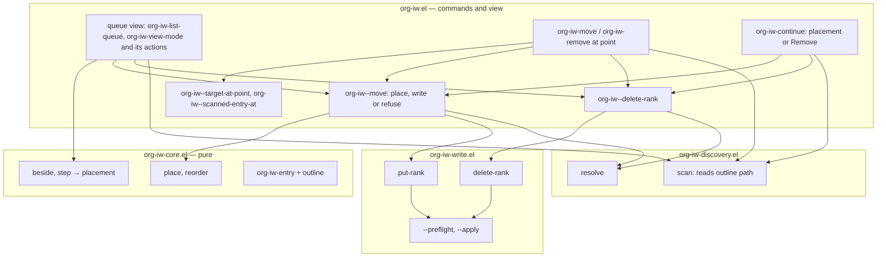
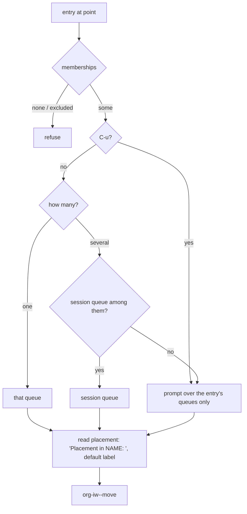

<!-- doctrine:section sec-01-problem -->
## 1. Design Problem

SL-002 lets the user reinsert the session's entry at a named placement.
The user still can't see a queue's order, or reorder or leave a queue
except by editing `IW_<Q>` ranks by hand. SL-003 adds:

- a **queue view**: one row per member in queue order, with the ordinal,
  title, a dimmed outline context and the file. From it the user can open
  an entry, move it up or down, place a marked entry before or after
  another, remove a membership, and refresh (REQ-013);
- **Move** from the source entry: put the entry at point at one of its
  queue's placement labels (REQ-017);
- **Remove** of one membership, from the view, from the source entry, or
  as a final choice in Continue's chooser (REQ-018).

Every reorder still goes through SL-002's `org-iw-core-place`, and every
write through the write layer's shared preflight. No new rank arithmetic
is introduced.

Out of scope: redistribution when no rank fits (SL-006; until then the
command stops and reports); document enrolment and document identity
(SL-004, QUE-002); moving from the source by position number or relative
to another entry (DEC-012); uniform title rendering in the mode line and
messages (IMP-005); same-named files in different directories (ASM-001).

<!-- doctrine:section sec-02-current -->
## 2. Current State

SL-002 is done. The parts SL-003 changes (research.md, Thread 2):

- **Entries** (`org-iw-entry`, `org-iw-core.el`) hold `id title file
  memberships`, with no outline context. Discovery scans each source file
  in an Org-mode temp buffer, so the outline path is available without
  extra I/O (research fact 1 ✓).
- **One write verb.** `org-iw-write-put-rank` is type checks →
  `org-iw-write--preflight` → `org-iw-write--apply` with a put lambda.
  Only the lambda is specific to setting a rank (fact 2 ✓). The file's
  commentary calls it "the one write path".
- **The entry at point** is found by `org-iw--add-target`, which refuses
  before the first heading ("document targets are not yet supported").
  Discovery and the write layer already handle document entries (a
  drawer before the first heading, a marker at `point-min`).
- **Placing a member.** Continue calls `org-iw-core-place` and handles
  its three outcomes inline. `org-iw--refuse-no-room WHERE NAME` owns the
  refusal "no room at WHERE in NAME; redistribution is not yet available
  — choose another placement".
- **The chooser** `org-iw--read-placement QUEUE` offers only the queue's
  labels. DEC-011 deferred Remove to SL-003.
- **Visiting.** `org-iw--visit` always uses `pop-to-buffer-same-window`
  and starts the session. `org-iw-visit-next` picks its queue inline: the
  session's queue, unless there is a prefix argument or no session, in
  which case it calls `org-iw--read-queue SCAN`, which offers every
  configured and discovered queue and accepts any typed ID.
- **Absence.** `org-iw--refuse-absent SCAN SESSION` says why the
  session's entry is missing (duplicated ID, or no longer in the queue).
  It is tied to the session.
- There is no mode, keymap or view in the package yet.

<!-- doctrine:section sec-03-forces -->
## 3. Forces & Constraints

Governance (research.md Thread 1; confirmed in the run):

- **ADR-001 / DEC-003:** queue state lives on the entry. The view is a
  disposable display. Every action and refresh rescans, and the view
  keeps no queue state.
- **ADR-002:** writes go through visiting buffers under the save policy.
  Undoing one change is ordinary buffer undo in the source (REQ-021,
  REQ-022).
- **ADR-003 (+ REV-002):** the mutation layer "sets or removes one
  property". The view belongs to the command layer and holds no ordering
  logic.
- **ADR-004 / SL-002 I10:** the core alone computes ranks, depths and
  neighbours. No-op → no write; no gap → stop before any change.
- **POL-002:** one implementation per concept: one preflight, resolver,
  queue prompt, placement chooser, no-room refusal, absence refusal, and
  prompt recorder in tests.
- **POL-003:** a human trial (VH) is required before close.
- **STD-001:** every new refusal is killed by a test; literals are
  pinned; a test that reaches a prompt binds the reader.
- **STD-003:** the write path changes, so the pre-close review roster
  scales up, or the audit justifies not doing so.
- **STD-004:** four source files. `--` symbols are file-private, so the
  view lives in `org-iw.el` (research X1 ✓). Tests mirror the sources.
- **DEC-005:** one global session, cleared only by `org-iw-end-session`.
- **REQ-004 / REQ-018:** Remove deletes exactly one `IW_<Q>` line;
  everything else is byte-identical.
- **REQ-008:** the view shows ordinals 1..N, never ranks.
- **REQ-024:** Emacs 30.1+, built-ins only. `tabulated-list-mode` is
  built in.

Verified facts this design relies on (research.md):

- `org-entry-delete` matches the key under `case-fold-search`. With it
  nil, a lowercase `:iw_a:` is not deleted and the call returns nil
  (fact 3 ✓).
- Any depth is `(after N)` for N in [0, count], counted over the order
  without the target (fact 4 ✓).
- `org-get-outline-path` at a heading returns its ancestors with
  statistics cookies stripped and links reduced to their descriptions,
  and returns nil before the first heading (fact 1 ✓; re-run on Emacs
  31.1 while drafting).
- `tabulated-list-print` with REMEMBER-POS restores point by the row ID,
  compared with `equal`. The view's `buffer-undo-list` is t (fact 7).

<!-- doctrine:section sec-04-principles -->
## 4. Guiding Principles

- **The view is a window onto the files.** Rows are display only. Every
  action rescans, finds its entry by Org ID, writes against the rank it
  just scanned, then redraws from a fresh scan. A source undo followed by
  `g` shows the truth.
- **Every reorder is a placement.** View moves, Move and Continue all
  become a placement and go through `org-iw-core-place`. Up/down and
  before/after are translated by pure core helpers (DEC-013), so the
  command layer never computes a depth.
- **One helper per act.** Placing an existing member and removing one are
  each a single command-layer helper, shared by Continue, Move, Remove and
  the view. The no-room, absence and session-hint texts each have one
  owner.
- **Two write verbs, one path.** Delete sits beside put-rank and shares
  its preflight and atomic apply (DEC-014).
- **The session changes only when the user opens an entry.** Move,
  Remove and view reorders never touch it (DEC-015). Opening from the
  view and Continue set it, as before.
- **Bind as little as possible.** The view binds only the keys DEC-019
  lists, so the user's search and jump commands still work in it.

<!-- doctrine:section sec-05-1-system-model -->
## 5. Proposed Design

### 5.1 System Model

The four layers stay as they are (ADR-003). Each layer gains one small,
cohesive piece. The diagram shows SL-003's additions and the existing
functions they call. Arrows point from caller to callee.



- `org-iw--move` is the only caller of `org-iw-core-place` for an
  existing member. It writes with put-rank or refuses no-room. Add keeps
  its own call with a nil target, since it enrols a new member through
  put-rank's `:absent` and `:ensure-id`.
- `org-iw--delete-rank` is the only caller of `org-iw-write-delete-rank`.
- The view's only route to the core's ordering rules is `beside` and
  `step`, whose placements it passes to `org-iw--move`. Besides those it
  reads the queue order (`org-iw--order`) and entry fields, as every
  command does.

<!-- doctrine:section sec-05-2-interfaces -->
### 5.2 Interfaces & Contracts

**`org-iw-core.el`: the entry** (DEC-017)

```elisp
(cl-defstruct org-iw-entry
  id title file memberships
  outline)   ; list of ancestor heading strings, outermost first;
             ; nil at top level and for a document entry
```

**`org-iw-core.el`: relative moves** (DEC-013). Both are pure. They
return a placement that the caller passes unchanged to
`org-iw-core-place`. Indices count the order *without* TARGET, which is
how `place` measures depth.

```elisp
(org-iw-core-beside ORDER TARGET ANCHOR SIDE)
;; ORDER: members in queue order.  TARGET, ANCHOR: elements of ORDER (eq).
;; SIDE: before or after.
;; → (after J) for before, (after (1+ J)) for after, where J is ANCHOR's
;;   index in ORDER without TARGET.  ANCHOR eq TARGET → (after I), I being
;;   TARGET's own index, so place answers unchanged.

(org-iw-core-step ORDER TARGET DELTA)
;; DELTA: an integer, -1 up (towards the front), +1 down.
;; → (after K), K = TARGET's index in ORDER plus DELTA, clamped to
;;   [0, (length ORDER) - 1].  So up at the front and down at the end come
;;   back from place as unchanged.
```

**`org-iw-discovery.el`.** `org-iw-discovery--read-entry` sets
`:outline (org-get-outline-path)` on each entry it creates. Nothing else
changes. Discovery stays the only reader of Org text.

**`org-iw-write.el`** (DEC-014)

```elisp
(cl-defun org-iw-write-delete-rank (marker queue &key expected)
  "Delete the rank of the entry at MARKER in QUEUE. ..."
  (cl-check-type queue (satisfies org-iw-core-canonical-queue-id-p))
  (cl-check-type expected integer)
  (org-iw-write--preflight marker queue expected)
  (org-iw-write--apply
   marker
   (lambda ()
     ;; org-entry-delete skips a lowercase key unless this is t.
     (let ((case-fold-search t))
       (unless (and (org-entry-delete marker (concat "IW_" queue))
                    ;; Org removes a drawer the delete emptied.
                    (org-get-property-block))
         (error "IW_%s not deleted alone" queue))))))
```

- EXPECTED is required, and it is the rank that was scanned. Preflight
  refuses a duplicated or `IW_<Q>+` key before `org-entry-delete`, which
  would otherwise remove those lines too.
- Precondition: the entry's drawer holds something besides the rank.
  Every scanned member does, since its `:ID:` is in the same drawer.
  Without that, Org would delete the emptied drawer, three lines.
- The `error` is an invariant check, not a refusal. It fires if nothing
  was deleted or if the drawer is gone. Neither can happen for a scanned
  member after preflight passes. If it does fire, `--apply` rolls the
  edit back.
- The return value is the same as put-rank's: `saved`, `unsaved`, or
  `(save-failed . ERR)`.
- The file's commentary and title line describe a write layer with two
  operations sharing one preflight and apply. Put-rank's docstring drops
  "the one write path" and adds the refusal "buffer is read-only"
  (ISS-001).

**`org-iw.el`: shared helpers** (private)

```elisp
(org-iw--target-at-point)
;; Renamed from org-iw--add-target (DEC-018).  → a marker at the heading
;; at or above point, ignoring narrowing, or at point-min when point is
;; before the first heading (the document entry).  Refuses unless the
;; buffer visits a source file and is in Org mode.  Add then refuses a
;; document marker itself, "document targets are not yet supported", in
;; its interactive spec too, so the refusal still comes before the queue
;; prompt.

(org-iw--find-entry ENTRIES ID &optional FILE)
;; → the element of ENTRIES with ID (and FILE, when given), or nil.  The
;;   one lookup by ID (POL-002): org-iw--check-heading (via cl-position on
;;   the result), org-iw--scanned-entry-at, Continue and the view use it.

(org-iw--scanned-entry-at MARKER SCAN)
;; → (org-iw--find-entry (org-iw-scan-entries SCAN) ID FILE), ID the entry
;;   ID at MARKER and FILE its file's truename.  Otherwise refuses:
;;   the ID has problems in SCAN → "entry at point is excluded (TYPES)";
;;   otherwise (including no ID) → "entry at point is not in any queue".

(org-iw--known-queues SCAN)
;; → the sorted, unique canonical IDs of configured and discovered
;;   queues (today's candidate list inside org-iw--read-queue).

(org-iw--read-queue QUEUES &optional REQUIRE-MATCH)
;; Generalised: completing-read "Queue: " over QUEUES, annotated with
;; configured names.  Callers pass (org-iw--known-queues SCAN), or an
;; entry's memberships with REQUIRE-MATCH t.  One queue prompt (POL-002).

(org-iw--read-session-queue)
;; visit-next's rule, extracted: the session's queue, unless there is a
;; prefix argument or no session, then org-iw--read-queue over the known
;; queues.  Used by org-iw-visit-next and org-iw-list-queue.

(org-iw--membership-queue ENTRY &optional ASK)
;; DEC-012's rule, refined by DEC-020; used interactively by Move and
;; Remove, which pass the prefix argument as ASK.
;; → with ASK, read with org-iw--read-queue over ENTRY's queues,
;;   REQUIRE-MATCH t, even when there is one.  Otherwise ENTRY's only
;;   queue; with several, the session's queue if it is one of them; else
;;   read as with ASK.

(org-iw--move SCAN ORDER ENTRY QUEUE PLACEMENT &optional WHERE)
;; ENTRY: an element of ORDER, QUEUE's members in SCAN.
;; → (unchanged DEPTH), writing nothing, or (moved DEPTH STATUS) after
;;   writing with put-rank against ENTRY's scanned rank.  On no-gap,
;;   refuses through org-iw--refuse-no-room with WHERE, or "at position
;;   DEPTH+1/N" when WHERE is nil.  Replaces Continue's inline handling.

(org-iw--delete-rank SCAN ENTRY QUEUE)
;; The sibling of org-iw--put-rank: resolves ENTRY and deletes its rank
;; with org-iw-write-delete-rank, expecting the scanned rank.  → STATUS.

(org-iw--refuse-absent SCAN QUEUE ID TITLE)
;; Generalised from (SCAN SESSION), with texts that name no act, since
;; it now serves moves, removes and anchors: "ID X is duplicated; TITLE is
;; excluded from queue NAME", or "TITLE is no longer in queue NAME".
;; Continue passes the session's fields; the view passes the row's.

(org-iw--refuse-no-room WHERE NAME)
;; "no room WHERE in NAME; redistribution is not yet available".  WHERE
;; carries its preposition (§ 5.4, Messages).

(org-iw--session-hint)
;; → "The session still names it: org-iw-visit-next to go on,
;;   org-iw-end-session to stop".  The one owner of DEC-015's hint.

(org-iw--visit SCAN ENTRY QUEUE POS TOTAL &optional OTHER-WINDOW)
;; OTHER-WINDOW non-nil shows the entry with (pop-to-buffer BUFFER t),
;; selecting another window; otherwise pop-to-buffer-same-window, as now.
```

**Vocabulary** (DEC-016). `org-iw--check-placements` also refuses a label
equal to "Remove", ignoring case, echoing the label as configured:
`SOURCE: label "REMOVE" is reserved`.
`org-iw--read-placement` gains an argument:

```elisp
(org-iw--read-placement QUEUE &optional WITH-REMOVE)
;; WITH-REMOVE non-nil appends the candidate "Remove" after the labels.
;; It is never the default.  → a label, or the symbol remove when
;; "Remove" was chosen.  The prompt names the queue: "Placement in
;; NAME: ", NAME the queue's display name (DEC-020).
```

**Commands** (public)

```elisp
;;;###autoload
(org-iw-move QUEUE &optional LABEL)
;; Move the entry at point to placement LABEL (nil: the default) of QUEUE.
;; Interactively: QUEUE by org-iw--membership-queue, always read with
;; C-u (DEC-020), then LABEL by org-iw--read-placement (always prompts;
;; DEC-012).

;;;###autoload
(org-iw-remove QUEUE)
;; Remove the entry at point from QUEUE.  Interactively: QUEUE by
;; org-iw--membership-queue, always read with C-u (DEC-020).  No confirmation: the source buffer has undo.

(org-iw-continue &optional LABEL)
;; LABEL may also be the symbol remove.  The prefix chooser passes
;; WITH-REMOVE.

;;;###autoload
(org-iw-list-queue QUEUE)
;; Show the queue view of QUEUE.  Interactively: org-iw--read-session-queue.
```

**View** (DEC-019)

```elisp
(define-derived-mode org-iw-view-mode tabulated-list-mode "IW Queue" ...)
(defvar-local org-iw--view-queue nil)  ; canonical queue ID shown
(defvar-local org-iw--view-mark nil)   ; Org ID of the marked entry, or nil

(org-iw--view-buffer QUEUE)
;; → the live org-iw-view-mode buffer whose org-iw--view-queue is QUEUE,
;;   else a new one named (generate-new-buffer "*org-iw: NAME*").  Found by
;;   queue ID, so two queues with one :name get two buffers.  Only a new
;;   buffer gets org-iw-view-mode and org-iw--view-queue: turning the mode
;;   on again would kill the buffer-local mark and queue.

(org-iw--view-redraw SCAN &optional GOTO-ID)
;; The one redraw.  Sets tabulated-list-entries from SCAN, prints, puts
;; point on GOTO-ID's row (else the row it was on, by ID; if that entry
;; is gone, the same line, or the last row when fewer remain; RV-007
;; F-9), re-tags the mark or clears it if its entry is gone, and sets
;; the point of every window showing the buffer to the buffer's point.
;; The last step is
;; needed because tabulated-list-print erases the buffer, which resets
;; the point of a window that is not selected, as after RET.
```

The mode sets a buffer-local `revert-buffer-function` that calls
`(org-iw--view-redraw (org-iw--scan))`, so `g` is the same redraw.
`tabulated-list-revert-hook` is not used: `tabulated-list-revert` prints
again after the hook, which would erase the mark's tag.

| key | command | does |
|---|---|---|
| RET | `org-iw-view-open` | visit the entry in another window; sets the session |
| M-<up> / M-<down> | `org-iw-view-move-up` / `-down` | `step` −1 / +1 |
| m / u | `org-iw-view-mark` / `-unmark` | mark the entry at point (replacing any mark) / clear |
| b / a | `org-iw-view-place-before` / `-after` | `beside` the marked entry before / after the entry at point; clears the mark |
| D | `org-iw-view-remove` | `y-or-n-p "Remove TITLE from NAME? "`, then delete |
| g, q, n, p | inherited | refresh (rescan), quit, next, previous |

Each view command is interactive only, takes no arguments, and returns
the message shown.

<!-- doctrine:section sec-05-3-data -->
### 5.3 Data, State & Ownership

**Source state:** unchanged in form. One `IW_<Q>` rank per membership
(ADR-001). Remove deletes that line. Nothing else is written.

**Derived state:** the scan. Its entries gain `outline`. For example, a
heading `*** Draft` under `* Essays [[id:x][Ideas]] [1/3]` and `**
Craft`, and a document entry, scan as:

```elisp
#s(org-iw-entry :id "a1" :title "Draft" :file "/notes/20260901--essays.org"
                :memberships (("ARTICLES" . 3072))
                :outline ("Essays Ideas" "Craft"))
#s(org-iw-entry :id "d7" :title "Reading list" :file "/notes/reading.org"
                :memberships (("ARTICLES" . 4096))
                :outline nil)
```

**View state.** All of it is buffer-local display state in the queue's
view buffer, named `*org-iw: NAME*` and found by queue ID
(`org-iw--view-buffer`):

- `org-iw--view-queue`, the queue shown;
- `org-iw--view-mark`, the marked entry's Org ID. This is UI state, not
  queue state (ADR-001). After a redraw it is shown again as a
  tabulated-list tag (`tabulated-list-padding` 2) if the entry is still
  listed, and cleared otherwise;
- `tabulated-list-entries`, the rows of the last scan. They are used only
  to find the ID and title at point.

Rows (`tabulated-list-entries`), one per member in queue order:

```elisp
("a1"   ; row ID = Org ID, so REMEMBER-POS follows an entry across redraws
 ["3*" ; ordinal 1..N (REQ-008); "*" marks the session's entry: the
       ; session's queue is the view's and its ID is the row's
  "Draft"                    ; org-link-display-format of the title;
                             ; bold on the session's row
  "Essays Ideas / Craft"     ; outline joined by " / ", shadow face
  "20260901--essays.org"])   ; file-name-nondirectory
```

`tabulated-list-format` is `[("#" 5 nil :right-align t) ("Title" 40 nil)
("Context" 30 nil) ("File" 0 nil)]`, and no column sorts. The context
text is made by a pure helper `org-iw--outline-text OUTLINE WIDTH`. If the
joined path is wider than WIDTH (30), it drops the outermost ancestors
and prefixes "…/" until the text fits. If the nearest ancestor alone is
too wide, it keeps that ancestor's right end. The nearest ancestors stay
visible this way (DEC-017).

**Session state:** unchanged in form (DEC-005). Opening from the view
sets it through `org-iw--visit`. Continue's Remove sets it by visiting
the new head. Nothing else in SL-003 sets or clears it.

<!-- doctrine:section sec-05-4-dynamics -->
### 5.4 Lifecycle, Operations & Dynamics

**Move from the source** (`org-iw-move QUEUE &optional LABEL`):

1. `org-iw--queue-id QUEUE` canonicalises the queue, as Add does.
2. `org-iw--target-at-point` gives a marker. A document is allowed.
3. `org-iw--placement QUEUE LABEL` gives the label and placement. Bad
   config or an unknown label refuses before the scan.
4. Scan, then `org-iw--scanned-entry-at`. Refuse "TITLE is not in queue
   NAME" unless the entry has QUEUE among its memberships.
5. `org-iw--move` with WHERE "at LABEL". The session is unchanged and
   nothing is visited.

Interactively, the interactive spec runs steps 2 and 4 first, so the
queue is chosen and the label read before the body rescans. That double
scan is the same as Add's (IMP-002).



**Remove from the source** (`org-iw-remove QUEUE`): steps 1, 2 and 4 as
for Move, then `org-iw--delete-rank` and the remove message.

**Continue** (`org-iw-continue &optional LABEL`). LABEL is a label, nil
(the default) or the symbol `remove`:

1. No session → refuse, as SL-002.
2. Unless LABEL is `remove`, resolve the placement (SL-002). Remove isn't
   a placement, so a Lisp call `(org-iw-continue 'remove)` works even
   when the vocabulary is broken. The interactive chooser resolves the
   vocabulary to list its labels, so with bad config it refuses before
   the prompt, Remove included. The user fixes the config, as for any
   placement.
3. Scan and order. Empty queue → "Queue NAME is empty", as SL-002.
4. Find the session's entry with `org-iw--find-entry`, else
   `org-iw--refuse-absent`.
5. Remove: `org-iw--delete-rank`, without the sole-entry check. If
   members remain, visit the head of the rest. If not, report the empty
   queue with the hint and leave the session (DEC-016).
6. Placement: the sole-entry report, then `org-iw--move` with WHERE "at
   LABEL" in place of the inline `pcase`. SL-002's messages and
   navigation are unchanged.

**Queue view.** `org-iw-list-queue QUEUE` canonicalises QUEUE, gets
`org-iw--view-buffer` (which sets up only a new buffer), redraws from a
fresh scan, keeping an existing view's mark, and shows it with `pop-to-buffer`. It reports the
queue through `org-iw--report`, so the message carries the scan-problem
suffix like every other (RV-007 F-6): "Queue NAME: N entries" ("1
entry"), or "Queue NAME is empty", which shows an empty view.

Every action that writes follows one pattern. The diagram shows
M-<down>.

```mermaid
sequenceDiagram
  actor U as User
  participant V as view command
  participant D as discovery
  participant K as core
  participant C as org-iw--move / --delete-rank
  U->>V: M-<down> on row "a1"
  V->>V: row ID at point (refuse "no entry at point")
  V->>D: scan
  V->>V: order; find-entry "a1" (else refuse-absent)
  V->>K: step(order, entry, +1) → (after K)
  V->>C: move(scan, order, entry, queue, (after K))
  C->>K: place → moved D RANK
  C->>C: put-rank, expected = scanned rank
  V->>D: scan again
  V->>V: view-redraw(scan, "a1"); message
```

- **Open (RET):** find the row's entry in a fresh scan, then
  `org-iw--visit` it with OTHER-WINDOW at its fresh ordinal. Then
  `org-iw--view-redraw` with the same scan, so the session marker moves
  and the view window keeps its row.
- **Mark (m) and unmark (u):** set or clear `org-iw--view-mark` from the
  row ID and re-tag in place. Neither rescans; the mark is checked
  against a fresh scan when it is used.
- **Place (b/a):** without a mark, refuse "no marked entry; mark one
  with m". Otherwise rescan and find both the marked entry and the entry
  at point (the anchor), refusing through `org-iw--refuse-absent` if
  either is gone. Then `beside` and `org-iw--move`, and redraw with
  GOTO-ID the marked entry. The mark clears whenever `org-iw--move`
  returns, whether `moved` or `unchanged`, since the entry is where the
  user asked. A refusal keeps the mark.
- **Remove (D):** row ID (or refuse), rescan, find the entry (or refuse
  absent). Then confirm `y-or-n-p "Remove TITLE from NAME? "` with the
  scanned title, delete against that scan, and redraw with GOTO-ID the
  next row's ID (else the previous row's), taken from the rows before
  the redraw. A source edit made during the prompt is still caught by
  preflight.
- **Refresh (g):** `revert-buffer-function` → `org-iw--view-redraw` with
  a fresh scan, then the same report as `org-iw-list-queue` (RV-007 F-6).
- The view never refreshes itself when the source changes.

**Messages.** T is the scanned title and NAME the queue's display name.
D/N is the entry's 1-based position after the act, out of N members.
STATUS is `org-iw--save-status`, and HINT is `org-iw--session-hint`.
Sentences join with ". ", and a message has no final period.

| act | message |
|---|---|
| view show, refresh (g) | "Queue NAME: N entries" ("1 entry") · empty: "Queue NAME is empty" |
| view move | "Moved T to D/N STATUS" · "T already at D/N" |
| source Move | "Moved T to LABEL in NAME, D/N STATUS" · "T already at LABEL in NAME, D/N" |
| Remove, view or source | "Removed T from NAME STATUS" · if T is the session's entry in its queue: "Removed T from NAME STATUS. HINT" |
| Continue Remove | "Removed T from NAME STATUS. Now 1/N: NEXT" · queue now empty: "Removed T from NAME STATUS. Queue NAME is empty. HINT" |
| no room (inq-9, one owner) | "no room WHERE in NAME; redistribution is not yet available" |

WHERE for the no-room refusal:

- "at LABEL" for Continue, Add with a label, and Move;
- "at the end" for a plain Add;
- "before T" or "after T" for view b/a, where T is the entry at point;
- "at position D/N" for view up/down (user ruling during drafting): `step`
  returns no neighbour, and the view shows ordinals.

The advice "choose another placement" is dropped. The message is
temporary until SL-006 adds redistribution.

<!-- doctrine:section sec-05-5-invariants -->
### 5.5 Invariants, Assumptions & Edge Cases

SL-001's I1–I8 and SL-002's I2′ and I9 stand. I10 is restated, and
four invariants are added:

- **I10′.** Every rank written comes from `org-iw-core-rank-at`, and
  every placement decision from `org-iw-core-place`. Depths and
  neighbours that decide a rank or placement are computed only in the
  core: by `placement-depth`, or by `beside` and `step`, which translate
  a relative move into a placement. The command layer computes none.
  Display and navigation choices are exempt, for example the row to land
  on after D, Continue visiting the head, or an ordinal in a message.

- **I11. Remove writes one line.** A successful Remove deletes exactly
  one `IW_<Q>` line in one file, and the drawer stays. Every other property, membership,
  `IW_AFTER_<Q>` line, heading, TODO state and body is byte-identical
  (REQ-004, REQ-018). A refused Remove changes nothing.
- **I12. Rows are display only.** No view action writes from row data.
  It rescans, finds the entry by ID, and writes against the scanned
  rank. After a source undo, an action on a stale row either acts on
  the truth or refuses. It never refuses "changed since scan" just
  because the row was stale.
- **I13. The session changes only when the user opens an entry.** Move,
  source Remove, and view moves and removes leave `org-iw--session`
  unchanged (`eq`). Only RET in the view, Continue and visit-next set it.
- **I14. One placer.** Every rank change of an existing member goes
  through `org-iw--move`, so through `org-iw-core-place`.

Core properties (property-tested, § 9): for random orders, targets and
anchors distinct from the target (the anchor-is-target case is a table
test: unchanged),

- reordering by `beside`'s placement puts TARGET immediately on SIDE of
  ANCHOR, with the others' relative order unchanged;
- reordering by `step`'s placement moves TARGET one position by DELTA,
  clamped, with the others unchanged.

Edge cases:

- **Up at the front, down at the end, b/a when already adjacent, or the
  marked entry is the entry at point** → `unchanged`: no write, "T
  already at D/N".
- **Equal-rank neighbours** (from hand edits) → `no-gap`, refused until
  SL-006. Only a move that lands *between* two equal ranks refuses;
  swapping a tied pair, or moving one entry out of it, succeeds.
- **Gap exhaustion.** Placing entries repeatedly before or after the same
  entry halves one gap each time, as with SL-002's Soon (EVD-002: about
  11–12 uses at spacing 1024). Placing before whichever entry is first at
  the time never runs out (first − spacing).
- **Lowercase key.** `:iw_articles: 3072` is a member of ARTICLES, and
  Remove deletes it because the delete binds `case-fold-search`
  (fact 3).
- **Duplicated key or `IW_<Q>+`.** The scan excludes the entry, and the
  view doesn't show it. From the source, Remove refuses "excluded". If
  the key is duplicated after the scan, preflight refuses.
- **Document entries.** Move and Remove act on a member document, with
  the marker at `point-min`. A document without `:ID:` is not a member,
  so it refuses "not in any queue". Add still refuses documents.
- **Removing the session's entry** from the view or the source leaves
  the session; the message carries the hint. The view's `*` marker is
  gone after the redraw, while the mode line still names the entry
  (DEC-015).
- **Configured label "remove"** in any case → configuration refusal, on
  use, naming the source.
- **Same title, same parent, same file** → told apart only by ordinal
  (DEC-017 accepted gap). This meets REQ-013 AC2 ("distinguishable by
  file/outline context") only in part, and the two disagree; § 6 routes
  the reconciliation. Same-named files in different directories look
  alike (ASM-001).
- **A queue whose display name changes** → its view buffer keeps the old
  name until killed. It is still found by queue ID, and its rows are
  correct.

<!-- doctrine:section sec-06-open -->
## 6. Open Questions & Unknowns

No blocking questions remain. These are carried, not settled here:

- **QUE-002** (Denote identity and document ID policy) shapes SL-004.
  Move and Remove inherit its answer through discovery's ID reader and
  insert no ID.
- **ASM-001** (source file names are unique) is held. The File column
  shows the base name.
- **IMP-005**: the mode line and messages keep the raw title, while the
  view shows link descriptions.
- **IMP-002**: Move and Remove scan twice when interactive, as Add does.
- **REQ-013 AC2 vs DEC-017.** The requirement says same-title entries
  are distinguishable by context, without conditions. DEC-017 accepts
  same title, same parent and same file as told apart only by ordinal.
  At reconcile, raise a revision (REV) qualifying AC2 to the accepted
  gap.
- The DEC-009 revisit (default End vs Soon) still waits for SL-006.

<!-- doctrine:section sec-07-decisions -->
## 7. Decisions, Rationale & Alternatives

Durable (read with `doctrine show DEC-0NN`):

- DEC-012: source Move uses the queue's placement vocabulary. The queue
  comes from the entry's memberships, preferring the session's queue.
- DEC-013: `org-iw-core-beside` and `org-iw-core-step` turn relative
  moves into placements.
- DEC-014: `org-iw-write-delete-rank` shares preflight and apply.
  ISS-001 is closed in passing.
- DEC-015: removing the session's entry leaves the session, and the
  message gives a hint.
- DEC-016: Remove is a reserved final candidate in Continue's chooser.
  It refines DEC-011.
- DEC-017: the outline context is a dimmed column, read during the scan.
- DEC-018: one entry-at-point target. Move and Remove accept member
  documents.
- DEC-019: the view's surface: `org-iw-list-queue`, mark-then-place,
  open in another window, minimal keys.
- DEC-020: with `C-u`, Move and Remove always ask for the queue, among
  the entry's queues; the placement prompt names the queue. It refines
  DEC-012 (user ruling from the PHASE-08 trial).

Recorded on the design run, not as records:

- **inq-9:** `org-iw--refuse-no-room` keeps one owner. Its format is
  "no room WHERE in NAME; redistribution is not yet available", with the
  preposition inside WHERE, and the advice is dropped. It is temporary
  until SL-006.
- **Up/down no-room** names "at position D/N" (user ruling while
  drafting). The alternatives were "above/below T", which needs a
  neighbour that `step` doesn't return, and expressing up/down as
  `beside`, which needs a neighbour lookup in the command layer.

Local choices:

- **`org-iw--move` takes an optional WHERE**, and nil means the
  position. Only view up/down needs the depth-dependent text.
- **Source Remove doesn't confirm.** DEC-019's reason for confirming D
  is that the view has no undo, and the source buffer has undo.
- **The marked entry placed beside itself is unchanged**, not a
  refusal. It is a placement already satisfied, the same rule as
  "already at End".
- **`org-iw-list-queue` uses `pop-to-buffer`**, so the user's
  `display-buffer-alist` decides, as for other list buffers.
- **The context width is a constant (30), not an option.** No user has
  asked for one, and it is easy to add later.
- **Move and Remove take QUEUE from Lisp.** They prompt only in the
  interactive spec, as Add does.
- **Continue's Remove skips the vocabulary from Lisp.** Remove isn't a
  placement. The interactive chooser still needs a valid vocabulary to
  list labels; offering Remove alone on bad config would be a second
  chooser for a rare case.
- **`g` uses `revert-buffer-function`, not `tabulated-list-revert-hook`.**
  The hook's caller prints again afterwards, erasing the mark's tag.
  DEC-019 keeps the mark as a tag, so the view owns its redraw.
- **delete-rank checks that the drawer survives**, so the public write
  verb is safe on any entry, not only scanned members.
- **View buffers are found by queue ID**, not by name, so queues sharing
  a `:name` don't share a view.
- **b/a clears the mark on `unchanged` too**: the entry is where the user
  asked. Only a refusal keeps it.

<!-- doctrine:section sec-08-risks -->
## 8. Risks & Mitigations

- **Delete misses a lowercase key** (fact 3).
  - The delete binds `case-fold-search` to t and errors if nothing was
    deleted, inside the atomic apply.
  - A test removes `:iw_articles:`.
  - A test stubs `org-entry-delete` to return nil and shows the rollback.
- **Delete removes more than one line.** `org-entry-delete` would also
  delete a duplicate or `IW_<Q>+` line.
  - Preflight with an integer EXPECTED refuses those shapes first.
  - Org also deletes a drawer the delete empties. The invariant check
    errors, and the edit rolls back, if the drawer is gone.
  - I11's test compares the whole file, before and after.
- **Stale rows after a source undo** (research X5).
  - I12: every action rescans and targets by ID.
  - A test edits the source behind the view, then acts on the stale row.
- **Ties and front exhaustion** refuse until SL-006.
  - The refusal says where.
  - The human trial reaches one on purpose.
- **Lingering session after Remove** may confuse (DEC-015).
  - The message hint, the view's moving `*` marker and the README
    explain it.
- **A redraw resets the view window's point** when another window is
  selected, as after RET (verified, Emacs 30.2 and 31.1).
  `org-iw--view-redraw` sets the point of every window showing the
  view, and a test covers it.
- **The view shadows user keys.** Only DEC-019's keys are bound, and the
  rest are inherited from `tabulated-list-mode`.
- **Prompts in batch tests block** (mem.fact.emacs.batch-test-gotchas).
  - The recorder `org-iw-cmd-test--with-prompt` also stubs `y-or-n-p`,
    answering from the same answer list with `:yes` or `:no`. A nil
    answer would read as "no answers left", so booleans are not used.
    There is still one recorder (POL-002).
  - Suites run with `</dev/null`.

<!-- doctrine:section sec-09-quality -->
## 9. Quality Engineering & Validation

Gates as in SL-002 (POL-001): `just check` on every commit, `just gate` at
the end of each phase (lint, then `test-all` on 30.2 and 31.1), and `just
test-each`. Every new guard and refusal is killed by a test, or its
surviving mutant is justified, until CHR-001 lands a mutation recipe
(STD-001). The pre-close roster scales up for the write-path change
(STD-003).

**Core (`test/org-iw-core-test.el`)**

- `beside`, as a table over A B C D:
  - D before A → `(after 0)`;
  - A after D → `(after 3)`;
  - A before C → `(after 1)`, moved;
  - B before C → `(after 1)`, unchanged: B is already there;
  - anchor eq target → the target's own index.
- `step`: up from index 2 → `(after 1)`; up at the front → `(after 0)`;
  down at the end → `(after (1- length))`.
- **Property test** (seeded, about 500 cases, the SL-002 generator,
  anchors drawn distinct from the target):
  - for `beside`, `reorder` by the placement's depth leaves TARGET
    adjacent to ANCHOR on SIDE, with the others in order;
  - for `step`, TARGET's index changes by DELTA, clamped.
  - A self-test feeds the checker an off-by-one `beside` (the index
    counted in ORDER rather than ORDER without TARGET) and shows the
    checker rejects it.
- The entry struct's `outline` defaults to nil.

**Discovery (`test/org-iw-discovery-test.el`)**

- A nested heading's outline lists its ancestors, outermost first, with
  cookies stripped and links reduced.
- A top-level heading and a document entry have a nil outline.

**Write (`test/org-iw-write-test.el`)**

- delete-rank removes the one line. The file differs from before by
  exactly that line: other `IW_` lines, `IW_AFTER_<Q>`, other
  properties, TODO state and body are unchanged (I11, REQ-018 AC1).
- A lowercase `:iw_q:` is deleted.
- The preflight refusals, each with nothing changed: changed on disk,
  not writable, read-only buffer, rank changed since scan, duplicated
  key, `IW_<Q>+`, and an unrecognised drawer.
- `org-entry-delete` stubbed to return nil → error, buffer and modified
  flag restored.
- A drawer holding only `:ID:` and `IW_<Q>` loses one line and keeps
  `:ID:` and the drawer. A drawer holding only `IW_<Q>` (not a scanned
  member) → error, with nothing changed.
- Save policy: a clean buffer is saved; a modified one stays `unsaved`.
- Type checks: a non-canonical queue and a non-integer EXPECTED signal
  errors.
- A document entry's rank is deleted, and its `:ID:` and drawer stay.

**Commands (`test/org-iw-test.el`)**

- Move:
  - one membership → no queue prompt; the placement prompt offers the
    labels with the queue's default;
  - two memberships, no session → prompts over exactly those two
    (REQ-017 AC1);
  - two memberships with the session in one of them → no queue prompt;
  - with `C-u`, the queue prompt offers exactly the entry's queues, with
    one membership, and with the session in one of them (DEC-020);
  - the placement prompt reads "Placement in NAME: " (DEC-020);
  - moved writes one line and only that membership changes (REQ-017
    AC2); unchanged writes nothing; no gap → "no room at Soon in NAME;
    …", nothing changed;
  - the session is unchanged (`eq`), and the selected window and buffer
    are unchanged;
  - not a member, or excluded → each refusal; a member document moves;
  - from Lisp with a queue the entry isn't in → "T is not in queue
    NAME", nothing changed.
- Remove (source): deletes one line; the session is unchanged (`eq`);
  the hint appears only for the session's entry in the session's queue,
  with the exact literals of § 5.4 (DEC-015); no prompt is reached for a
  single membership, and `C-u` prompts over the entry's queues
  (DEC-020); a member document is removed; from Lisp with a queue the
  entry isn't in → refusal.
- Continue:
  - the chooser lists the labels then "Remove", last, and not the
    default (the recorder's `:order` and `:default`);
  - Remove deletes, then visits the new head and reports it, without
    reinserting (REQ-018 AC2);
  - Remove of the sole entry → "Queue NAME is empty" with the hint, and
    the session is kept;
  - `(org-iw-continue 'remove)` from Lisp works with a broken
    vocabulary;
  - Remove when the session's entry has left the queue, or its ID is
    duplicated → the absence refusals, nothing changed.
- Vocabulary: "remove", "Remove" and "REMOVE" as a label each refuse,
  naming the source and echoing the label as configured.
- The absence refusal's two texts, pinned.
- No-room texts (one owner): "at the end" for a plain Add, "at LABEL",
  "before T" / "after T", "at position D/N".
- `org-iw--outline-text`: fits as is; drops ancestors behind "…/";
  right end of an over-long nearest ancestor; empty outline → "".
- View:
  - rows: ordinals 1..N whatever the ranks (REQ-008); link-reduced
    title; context in the shadow face; file base name; the session's row
    has `*` and bold;
  - same-title entries in different parents show different contexts
    (REQ-013 AC2);
  - the queue prompt offers configured and discovered queues (REQ-013
    AC1), and the session queue is used without a prompt;
  - M-<down> and M-<up> move and point follows; at the end or front,
    "already", writing nothing;
  - m, then b or a on another row → the marked entry lands beside the
    entry at point, point is on the marked entry, and the mark clears;
    b/a already adjacent → nothing written, the mark clears; b without a
    mark refuses; a refused b/a (no gap, or the marked or anchor entry
    gone) keeps the mark; m on a second row replaces the mark; the mark
    survives `g` and `org-iw-list-queue` on the same queue, and is
    cleared when its entry leaves;
  - D with y → deleted, and point lands on the next row (else the
    previous one); D with n → nothing changed; D on a row whose entry
    has gone → refusal before the confirmation;
  - RET → the entry shows in another window and the session is set as
    by visit-next (REQ-013 AC4); the view's `*` moves; selecting the view
    window again finds point on the opened row;
  - refresh after a source undo shows the restored order (REQ-013 AC3);
    an action on a stale row after an undo acts on the fresh state
    (I12);
  - an empty queue opens an empty view and reports it;
  - each action off a row refuses "no entry at point";
  - view moves and D leave the session unchanged (`eq`) (I13);
  - two queues with the same `:name` get separate view buffers.
- Test support: the recorder also answers `y-or-n-p` (`:yes` or `:no`
  in the answer list) and records its prompt. A string answer to
  `y-or-n-p`, or a keyword answer to `completing-read`, fails the test.
  Its self-test covers each case.

**Human trial (VH, POL-003)** on a Git-committed copy of real notes:

1. `M-x org-iw-list-queue`: check the order, titles, context and files
   against the source.
2. Reorder with M-<up>/M-<down>, and with m then b/a, using your own
   search and jump commands to reach rows. Check that `git diff` shows
   one changed line per move.
3. RET an entry: it opens in the other window and the mode line names
   it.
4. D an entry. Undo in the source file, then `g`: the entry is back.
5. From a source heading with two memberships, `M-x org-iw-move` and
   `M-x org-iw-remove`.
6. `C-u M-x org-iw-continue`, choose Remove: the next entry opens.
7. Remove the session's entry from the view: read the hint, then go on
   with `org-iw-visit-next`.
8. Place different entries after one fixed entry, one after another
   (mark, then `a` on that entry), until "no room". Check that nothing
   changed.

<!-- doctrine:section sec-10-code-impact -->
## 10. Code Impact

| Path | Change |
|---|---|
| `org-iw-core.el` | `org-iw-entry` gains `outline`; add `org-iw-core-beside`, `org-iw-core-step` |
| `org-iw-discovery.el` | `--read-entry` sets `:outline` from `org-get-outline-path` |
| `org-iw-write.el` | add `org-iw-write-delete-rank`; title line, commentary and put-rank docstring reworded for two operations; put-rank lists "buffer is read-only" (ISS-001) |
| `org-iw.el` | `org-iw--add-target` → `org-iw--target-at-point` (Add keeps the document refusal); add `--find-entry` (also used by `--check-heading` and Continue), `--scanned-entry-at`, `--known-queues`, `--read-session-queue`, `--membership-queue`, `--move`, `--delete-rank`, `--outline-text`, `--session-hint`, `--view-buffer`, `--view-redraw`; generalise `--read-queue`, `--refuse-absent` (texts name no act), `--read-placement` (WITH-REMOVE); reword `--refuse-no-room`; reserve "Remove" in `--check-placements`; `--visit` gains OTHER-WINDOW; `--save-status` docstring covers both write verbs; Continue takes `remove` and uses `--move`; visit-next uses `--read-session-queue`; new `org-iw-move`, `org-iw-remove`, `org-iw-list-queue`, `org-iw-view-mode` and its commands and keymap; `--membership-queue` takes ASK and `--read-placement` names the queue (DEC-020) |
| `test/org-iw-core-test.el` | beside/step tables and properties, with a checker self-test |
| `test/org-iw-discovery-test.el` | outline cases |
| `test/org-iw-write-test.el` | delete-rank cases |
| `test/org-iw-test.el` | Move, Remove, Continue-Remove, reservation, no-room texts and view tests; the recorder also answers `y-or-n-p`; expectations change for the reworded no-room and absence refusals and the renamed target helper |
| `README.md` | the queue view and its keys; Move; Remove (view, source, Continue's chooser); the reserved "Remove" label; why removing the session's entry leaves the session, and how to go on or stop (DEC-015) |

Selectors (design-target): `org-iw-core.el`, `org-iw-discovery.el`,
`org-iw-write.el`, `org-iw.el`, `test/org-iw-core-test.el`,
`test/org-iw-discovery-test.el`, `test/org-iw-write-test.el`,
`test/org-iw-test.el`, `README.md`.

