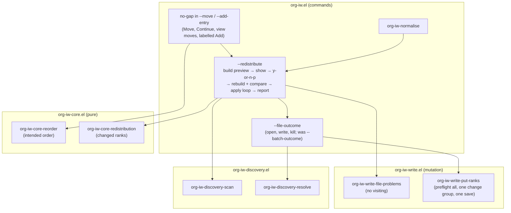

<!-- doctrine:section sec-01-problem -->
## 1. Design Problem

Placing an entry between two neighbours halves the rank gap between them
(ADR-004). After about ten placements into the same gap there is no
integer left, and today every such operation stops with "no room …;
redistribution is not yet available". Continue at Soon, a view move or
an Add at a label can all hit it. EVD-002 measured about eleven
Continues at one placement. The queue is then stuck at that spot until
the user hand-edits ranks.

SL-006 makes exhaustion recoverable, explicitly and safely:

- **A redistribution plan** (ADR-004 rules 5 and 6): the core re-lays a
  queue's members at the spacing, in the intended order, including the
  pending placement, and returns only the ranks that change.
- **A preview, then approval** (REQ-019): a buffer shows the counts, the
  affected files, the pending operation, the blockers, non-atomicity and
  a Git recommendation. Approval is one `y-or-n-p`, which also names
  any unsaved affected buffers it will save (DEC-029, DEC-037).
  Unwritable, read-only or changed-on-disk files block it (DEC-030).
- **A recheck, then a per-file apply** (REQ-019 AC2, REQ-020): on
  approval the plan is rebuilt and compared (DEC-033). Each file is
  written in one change group and saved once. The first failure stops
  the run, and the report partitions the files into saved, modified
  and untouched.
- **A handoff** (REQ-010, DEC-036): Move, Continue, the view moves and
  labelled Add offer this flow instead of refusing.
- **Normalise** (PRD-001 § 6, DEC-034): `org-iw-normalise` runs the same
  flow on demand, with no pending operation.
- **Continue reports before it visits** (DEC-038), which also resolves
  ISS-002.

Out of scope:
- rollback, recovery records, Git automation, local (partial)
  redistribution;
- a scan cache (DEC-027);
- a keyed preview mode (IMP-011);
- the spacing value (stays 1024, DEC-035);
- batch add's end-limit refusal (DEC-036);
- the DEC-009 default placement (deferred, inq-11).

<!-- doctrine:section sec-02-current -->
## 2. Current State

- **The core places one entry.** `org-iw-core-place` (`org-iw-core.el`)
  returns `(unchanged DEPTH)`, `(moved DEPTH RANK)` or `(no-gap DEPTH)`,
  DEPTH counted among the order without the target.
  `org-iw-core-reorder` builds the order with the target at DEPTH. It
  `remq`s the target first, so a non-member target is simply inserted.
  `org-iw-core-rank-spacing` is 1024.
- **Two no-gap consumers.**
  - `org-iw--add-entry` (`org-iw.el:478`) serves `org-iw-add`,
    `org-iw-add-document` and batch add.
  - `org-iw--move` (`org-iw.el:881`) serves `org-iw-move`, Continue's
    place and the four view moves (place before and after, up, down).
  - Both call `org-iw--refuse-no-room`, which signals.
- **One write at a time.** `org-iw-write-put-rank` and
  `org-iw-write-delete-rank` share `org-iw-write--preflight` (file
  checks, then entry checks) and `org-iw-write--apply`. The apply makes
  one `atomic-change-group` and one save, and returns `saved`, `unsaved`
  or `(save-failed . ERR)`. The file checks (`--check-file`) refuse on
  the first problem: changed on disk, not writable, read-only. A
  modified buffer is not a problem: it is written and left unsaved
  (ADR-002 save policy).
- **The scan never visits.** `org-iw-discovery-scan` reads a live
  buffer's text, else the file from disk (`org-iw-discovery.el:399-416`).
  `org-iw-discovery-resolve` visits on demand and finds an entry by ID in
  the live buffer. Positions from a scan are never reused.
- **Open, write, kill.** `org-iw--batch-outcome` (`org-iw.el:655`) visits
  a file if needed, calls a function and converts a refusal or file
  error into `(failed REASON)`. It kills the buffer it opened unless the
  buffer is modified, and then marks the outcome `left-open` (DEC-026).
  `org-iw--batch-report` lists trouble in a `special-mode` buffer
  (DEC-028).
- **Continue visits, then reports.** `org-iw--continue-place` and
  `--continue-remove` write, call `org-iw--visit`, then report. A
  refused visit hides the save status (ISS-002).
- **Prompts in tests.** Remove's `y-or-n-p` is the only recorded prompt
  (`org-iw-view-remove`). Batch Emacs blocks on an unrecorded prompt
  (mem.fact.emacs.batch-test-gotchas).

<!-- doctrine:section sec-03-forces -->
## 3. Forces & Constraints

- **ADR-004 rules 4–6.**
  - No gap means stop and say so; never renumber silently.
  - Redistribution re-lays every member at the spacing, in order,
    including the pending placement, only after an approved preview.
  - It writes through the shared preflight and apply.
  - The plan is pure core.
- **ADR-002.** Every write goes through the buffer under the save policy.
  A multi-file write is not atomic, and Git is the recovery path
  (REQ-020).
- **ADR-003 (with REV-002 and REV-004).** Every guard on a write lives in
  the mutation layer's preflight. Commands compose the layers and hold
  no ordering logic. STD-004 item 1 adds one file per layer: no new
  source file.
- **POL-002.** One owner each for placement, the preflight, the apply,
  the no-room text, the batch and redistribution report, and
  open-write-kill. No third preflight (DEC-014).
- **REQ-019.**
  - Cancel changes nothing.
  - A stale plan is re-previewed.
  - Unsaved edits are resolved explicitly, never discarded.
  - Unwritable targets are detected before any write.
  - Order is preserved, including the pending operation.
- **REQ-020.** On a write failure: stop, partition into
  saved/modified/untouched, and do not navigate.
- **PRD-001 § 4.** A blocked or cancelled operation leaves every file and
  buffer unchanged.
- **DEC-027.** Read through `org-iw-discovery-scan`; no per-file rescans.
  Under 200 files today; two scans per redistribution is fine.
- **STD-001.**
  - Literals pinned in core tests.
  - Real Org files through the fixture.
  - A cancel oracle that proves nothing changed.
  - A mutation check over every guard.
- **STD-003.** The write path changes and redistribution is named, so the
  pre-close review roster scales up.

<!-- doctrine:section sec-04-principles -->
## 4. Guiding Principles

1. **One plan, two triggers.** The handoff and normalise differ only in
   the intended order they hand the core.
2. **The preview is data first.** The command builds one plain-data
   preview. The buffer renders it, the recheck compares it, and tests
   assert on it.
3. **Look, don't touch.** Nothing opens a buffer or changes state until
   approval. File checks read existing buffers and the file system.
4. **Consent, don't assume.** org-iw saves a modified buffer only when
   the approval prompt named it, and never reverts or discards. Problems
   that saving cannot fix (changed on disk, read-only, unwritable) block,
   and are listed.
5. **Generalise the write path, don't fork it.** The grouped write is
   the single-entry write with many edits, and `put-rank` becomes its
   one-element case.
6. **Per file is the unit of failure.** Each file is written whole or
   not at all, and saved once, so the REQ-020 partition is exact.
7. **Report before navigating.** A write's outcome is never displaced by
   a later step's refusal.

<!-- doctrine:section sec-05-1-system-model -->
## 5.1 System Model

Redistribution is one flow with two entrances. This diagram shows
which layer owns each step; the arrows are calls.



- The **handoff** computes the intended order with `org-iw-core-reorder`,
  which it already uses after a move, and passes that order and a
  description of the pending operation to `org-iw--redistribute`.
- **Normalise** passes the queue's current order.
- `org-iw--redistribute` owns the flow. It is the only caller of
  `org-iw-core-redistribution` and of the file loop. It holds no
  ordering logic: ranks come from the core, and guards come from the
  write layer.
- `org-iw-write-file-problems` is the one owner of the file checks.
  `org-iw-write--check-file` refuses with it, and the preview lists
  with it.
- `org-iw--file-outcome` is the open-write-kill helper, renamed from
  `org-iw--batch-outcome` now that batch add and redistribution share
  it.

<!-- doctrine:section sec-05-2-interfaces -->
## 5.2 Interfaces & Contracts

### 5.2.1 Core: the plan

`org-iw-core-place` and `org-iw-core-reorder` are unchanged. One new
pure function:

```elisp
(defun org-iw-core-redistribution (order queue)
  "Return the ranks that re-lay ORDER in QUEUE at the spacing.
ORDER is the intended order: members of QUEUE and at most one other
element standing for an entry joining QUEUE, compared with `eq'.  The
Kth element, counting from 1, belongs at K times
`org-iw-core-rank-spacing'.  Return (ELEMENT . RANK) for each element
not already at its rank, in ORDER's order; an element that is not a
member of QUEUE is always included."
  (cl-assert (org-iw-core-rank-p (* (length order) org-iw-core-rank-spacing)))
  (cl-loop for element in order
           for rank from org-iw-core-rank-spacing by org-iw-core-rank-spacing
           unless (eql rank (and (org-iw-entry-p element)
                                 (org-iw-core-rank element queue)))
           collect (cons element rank)))
```

- **Intended order.**
  - Pending move of member E to DEPTH (from `(no-gap DEPTH)`):
    `(org-iw-core-reorder order E depth)`.
  - Pending add: `(org-iw-core-reorder order JOINING depth)`. JOINING
    is the command's token for the new entry (§ 5.2.3); `reorder`'s
    `remq` leaves ORDER intact and inserts it.
  - Normalise: ORDER itself.
- **Excluded memberships** (invalid rank, duplicate ID) are not in
  ORDER, because the scan leaves them out, so they are never rewritten
  (REQ-007, DEC-032).
- **The limit** only matters past about 8.8×10¹² members, so it is an
  assertion, not a refusal.

Example: Continue puts D at Soon (depth 2) in a queue A 1024, B 1536,
C 1537, D 4096. The gap between B and C is gone.

| intended order | A | B | D | C |
|---|---|---|---|---|
| target rank | 1024 | 2048 | 3072 | 4096 |
| change | — (already 1024) | 1536 → 2048 | 4096 → 3072 | 1537 → 4096 |

Result: `((B . 2048) (D . 3072) (C . 4096))`. A is not rewritten.

### 5.2.2 Write layer: file checks and grouped puts

**File problems: one owner, two uses.**

```elisp
(defun org-iw-write-file-problems (file &optional buffer)
  "Return what stands in the way of writing FILE, or nil.
FILE is a truename; BUFFER is the buffer visiting it, by default
`find-buffer-visiting''s.  The result lists, in this order, those of
these symbols that hold: `changed-on-disk' (BUFFER's file changed since
visited), `not-writable', `read-only' (BUFFER is read-only), and
`modified' (BUFFER has unsaved changes).  Without BUFFER only
`not-writable' can hold.  No file is visited and nothing is changed.")

(defun org-iw-write-problem-text (problem)
  "Return the text for PROBLEM, a symbol from `org-iw-write-file-problems'.")
```

- `org-iw-write--check-file` (the refusing preflight) refuses on the
  first problem other than `modified`, using the same text. It keeps
  its own check for an indirect marker buffer that is read-only.
- A single-entry write still writes a modified buffer and leaves it
  unsaved (ADR-002). The texts stay as they are today:
  "changed on disk; revert first", "not writable", "buffer is
  read-only". `modified` reads "unsaved changes".
- The preview (§ 5.2.3) calls `org-iw-write-file-problems` for every
  affected file. Every problem other than `modified` blocks (DEC-030).
  A `modified` file is named in the approval prompt and saved on yes
  (DEC-029). The guards live in the write layer (ADR-003).

**Saving on consent.**

```elisp
(defun org-iw-write-save-file (file)
  "Save the buffer visiting FILE, which the user agreed to save.
Refuse, saving nothing, if FILE has a problem other than `modified'
\(see `org-iw-write-file-problems'): saving over a file changed on
disk would lose those changes.  Return `saved', or (save-failed .
ERROR) if saving signalled ERROR.")
```

`org-iw-write--apply`'s save-and-catch becomes `org-iw-write--save`,
used by both, so there is one owner of "save and report failure".

**Grouped puts.**

```elisp
(defun org-iw-write-put-ranks (changes)
  "Set the ranks of CHANGES through one buffer, saved once.
CHANGES is a list of (MARKER QUEUE RANK . KEYS), each read as the
arguments of `org-iw-write-put-rank', KEYS its keyword arguments.
Every MARKER is in the same buffer; else it is an error.

Each change is checked as `org-iw-write-put-rank' checks it, and all
are checked before anything changes, so the first refusal leaves the
buffer untouched.  The edits then run in order in one atomic change
group: if any signals, the buffer is restored and the error
propagates.  The base buffer is saved once if it had no unsaved
changes.  Return `saved', `unsaved' or (save-failed . ERROR), as
`org-iw-write-put-rank' does.")
```

Internally:
- **Prepare.** `org-iw-write--prepare-put` runs today's type checks
  and preflight for one change. It returns `(MARKER . EDIT)`, EDIT
  being today's put-rank lambda (new drawer, ID, `org-entry-put`).
- **Apply.** `org-iw-write--apply` takes the buffer and a list of
  `(MARKER . EDIT)`. It runs them all in one `atomic-change-group`,
  then saves once.
- **Callers.**
  - `org-iw-write-put-rank` becomes
    `(org-iw-write-put-ranks (list (cl-list* marker queue rank keys)))`
    with an unchanged docstring.
  - `org-iw-write-delete-rank` calls `--apply` with one edit.
- No preflight or apply exists besides these (POL-002, DEC-014).
- **Markers stay valid.** Edits move later markers in the same buffer
  forward. A document's new drawer goes in at `point-min`, where its own
  marker stays and the heading markers after it move. This is why
  today's edit writes the rank at `point-min`.
- **Why one buffer, not one base buffer.** An atomic change group is
  sound only within one buffer. Redistribution resolves markers with
  `org-iw-discovery-resolve`, which always returns base-buffer markers,
  so its edits for a file share one buffer. A single put through an
  indirect buffer is a group of one, as today.

### 5.2.3 Commands: the flow, the handoff, normalise

All in `org-iw.el`, under a new `;;;; Redistribution` section. Private
names are `org-iw--`.

**The joining entry.** A pending Add has no `org-iw-entry` yet, so it
appears in the intended order as a token:

```elisp
(cl-defstruct (org-iw--joining (:constructor org-iw--joining-create)
                               (:copier nil))
  "An entry about to join a queue: where it is and what it lacks."
  marker document id file title)   ; ID nil: the write gives it one
```

The core sees it only as "not a member", so it is always in the plan
(§ 5.2.1).

**The preview: one plain-data record.**

```elisp
(cl-defstruct (org-iw--redistribution
               (:constructor org-iw--redistribution-create) (:copier nil))
  "A redistribution plan as previewed."
  queue      ; canonical queue ID
  pending    ; text naming the pending operation, or nil (normalise)
  changes    ; ((ELEMENT . RANK) ...) from `org-iw-core-redistribution'
  files      ; ((FILE COUNT . PROBLEMS) ...), FILE a truename, in `string<' order
  problems   ; number of the scan's problems (never rewritten)
  key)       ; plain data compared by the recheck
```

- `files` lists each affected file once. COUNT is its number of
  changes. PROBLEMS is `org-iw-write-file-problems` of the file,
  `modified` included.
- `key` is `(MEMBERS . FILES)`. MEMBERS is `(ID FILE RANK)` for each
  member of the queue in the scan's order, and FILES is the `files`
  slot.
- DEC-033's equality test is `equal` on two keys. The intended order is
  a function of MEMBERS and the pending operation, so equal keys mean
  the same plan.
- `problems` is the scan's problem count, the figure every report
  already notes. Problems are not attributed to queues, so the preview
  says "N source problems ignored (never rewritten)" (DEC-032).

```elisp
(defun org-iw--redistribution-build (scan queue intend pending)
  "Return the redistribution of QUEUE in SCAN, as an `org-iw--redistribution'.
INTEND, called with SCAN, returns the intended order, or refuses (as
when the pending entry has left the queue).  PENDING is as the slot.
Nothing is visited or changed.")
```

**The flow.**

```elisp
(defun org-iw--redistribute (queue intend pending)
  "Preview the redistribution of QUEUE; on approval, apply it.
QUEUE, INTEND and PENDING are as for `org-iw--redistribution-build',
from a fresh scan.  Return the file outcomes if every file was written
and saved clean; else refuse, as described below.")
```

The function refuses in every case except a clean apply. A refusal
signal is how every org-iw command already stops without navigating,
so callers need no new branches for the unhappy paths:

| case | effect | refusal text |
|---|---|---|
| any file has a problem other than `modified` | preview shown, no prompt | "N files block redistributing Q (see *org-iw redistribution*); resolve them and repeat" |
| answered no | preview stays for browsing | "Redistribution of Q cancelled; nothing changed" |
| the key changed since the preview | preview rebuilt and shown again, then asked again | — (the flow loops) |
| a consented save fails | stop before any rank is written; the report names the file and the buffers already saved | "Redistribution of Q stopped before writing: FILE not saved: ERR" |
| a file fails | stop; the preview buffer becomes the REQ-020 report | "Redistribution of Q stopped: S saved, M modified, U untouched (see *org-iw redistribution*); not atomic" |
| all saved | preview buffer killed; outcomes returned | — |

- The prompt is
  `(y-or-n-p "Redistribute N entries in F files of Q? ")`. When affected
  buffers are modified it names them: "Redistribute N entries in F
  files of Q, saving a.org, b.org first? ". That single yes is both the
  approval and the explicit resolution of those buffers (PRD-001 § 4;
  REQ-019 AC3; DEC-029). There is no separate save question, so a no
  still changes nothing. The test stub already records `y-or-n-p`
  (`test/org-iw-test.el:77`).
- **After yes:** recheck (the key includes the `modified` flags, so a
  buffer modified while asking re-shows the prompt), then save each
  named buffer with `org-iw-write-save-file` in `files` order, then the
  apply. Every affected buffer is therefore clean when its ranks are
  written: one save per file afterwards, and the saved / modified /
  untouched partition stays exact.
- Rendering is `org-iw--redistribution-show`. It builds a `special-mode`
  buffer `*org-iw redistribution*` containing:
  - the queue;
  - the pending operation;
  - the counts;
  - "Not atomic: files are written one by one. Commit to Git first.";
  - the blockers, if any, and the buffers that approval will save;
  - one line per file, as a text button (`insert-text-button`) that
    calls `find-file-other-window`.

  It then calls `display-buffer`. Opening a file is the user's act:
  nothing is visited until then (DEC-031).

**The apply: one file at a time.**

- **Which record.** The apply runs the **rebuilt** record from the
  recheck, never the previewed one. Its changes, expected ranks and
  markers therefore all come from one scan.
- **Order.** Files go in `files` order. For each,
  `org-iw--file-outcome` (renamed from `org-iw--batch-outcome`) opens
  the file if need be and calls a function that:
  - resolves each change's marker with `org-iw--entry-marker` against
    the recheck's scan;
  - turns it into `(MARKER QUEUE RANK . KEYS)`;
  - calls `org-iw-write-put-ranks` once.
- **Arguments.** A member passes `:expected` its scanned rank. The
  joining entry passes `:expected :absent :ensure-id (null id)
  :document document`, exactly the arguments Add passes today.
- **Outcome.** `(written STATUS)`, `(failed REASON)` or `(stopped)`,
  plus `left-open`. `written` replaces batch add's `added`, and batch
  add keeps `added` and `existing`.
- **Stopping.** The loop continues only while each outcome is
  `(written saved)` without `left-open`. The rest are `(stopped)`.
- **Buffer lifetime.** `--file-outcome` already closes the buffers it
  opened once clean and keeps modified ones (DEC-031).
- **Partition** (REQ-020): `org-iw--outcome-partition`:
  - **saved**: `(written saved)`;
  - **modified**: `(written unsaved)`, `(written (save-failed . E))`,
    or anything with `left-open`;
  - **untouched**: `(failed …)` (the group was rolled back) and
    `(stopped)`.
- **Report.** The batch report and this report share one renderer.
  `org-iw--batch-report` becomes `org-iw--outcome-report (buffer
  heading groups)`, GROUPS being `((LABEL (FILE . OUTCOME) ...) ...)`.
  Batch add passes one group, "files needing attention", and
  redistribution passes three.

**The handoff.**

- **`org-iw--move`.** On `(no-gap DEPTH)` it calls
  `org-iw--redistribute`. INTEND finds the entry by ID in the fresh
  scan (`org-iw--find-member`) and reorders it to
  `(org-iw-core-placement-depth PLACEMENT (1- (length order)))`.
  - PENDING is "move TITLE WHERE", WHERE as today's no-room text has it.
  - It returns `(redistributed DEPTH OUTCOMES)`.
  - `org-iw--moved-text` gains this case: the moved text plus
    `org-iw--redistributed-text`, for example "redistributed 3 entries
    in 2 files, saved".
  - Move, Continue's place and the four view moves get this through
    `--move`, with no change of their own.
- **`org-iw--add-entry`.** On `(no-gap DEPTH)` it returns
  `(no-gap DEPTH JOINING)` instead of refusing, since it already holds
  the marker, document flag, ID and file.
  - `org-iw--add-at` (labelled Add and Add-document) hands off with
    PENDING "add TITLE at LABEL". It then reports
    "Added to Q at LABEL, D/N; redistributed …".
  - Batch add's `add-document` refuses with `org-iw--refuse-no-room`,
    as today (DEC-036).
- **`org-iw--refuse-no-room`** remains the one owner of the no-room
  text. Batch add is now its only caller, and the text becomes "no
  room %s in %s; normalise it with org-iw-normalise".

**Continue reports before it visits** (DEC-038). A new
`org-iw--visit-head (scan order queue)` visits the head and returns
nil. If the visit refuses, it returns the refusal text instead.
`--continue-place` and `--continue-remove`:
1. compute their write text;
2. call `--visit-head` (unless the remove emptied the queue);
3. report the write text, plus "; not visited: REASON" when the visit
   failed.

ISS-002 is resolved for both paths.

**Normalise.**

```elisp
;;;###autoload
(defun org-iw-normalise (queue)
  "Re-lay the ranks of QUEUE at the standard spacing, after a preview.
...")
```

- QUEUE is read with `org-iw--read-session-queue` (the session's queue
  by default).
- INTEND is `(lambda (scan) (org-iw--order scan queue))`, and PENDING
  is nil.
- If the build has no changes, it reports "Queue Q is already normal"
  and shows no preview (DEC-034).
- Otherwise it reports `org-iw--redistributed-text`.

<!-- doctrine:section sec-05-3-data -->
## 5.3 Data, State & Ownership

- **No new persistent state.** Ranks stay on the entries (ADR-001). No
  journal, undo log or stored plan (REQ-022, REQ-025).
- **No stored continuation.** The flow runs inside one command call
  (DEC-037), so the preview record lives only on the call stack. The
  `*org-iw redistribution*` buffer is a rendering, never read back.
- **Session.** It changes only on a successful Continue visit, as today.
  Every refusal leaves it unchanged.
- **Ownership.**

| concept | owner |
|---|---|
| target ranks (k × spacing), changed set | `org-iw-core-redistribution` |
| intended order | `org-iw-core-reorder` (the handoff), or the scan's order (normalise) |
| file checks and their text | `org-iw-write-file-problems`, `org-iw-write-problem-text` |
| which problems block, and which buffers approval saves | `org-iw--redistribute`, from the `files` problems |
| saving a buffer on consent | `org-iw-write-save-file` (shares `org-iw-write--save` with the apply) |
| per-entry guards (expected rank, drawer shape) | the write preflight, unchanged |
| one change group and one save per file | `org-iw-write-put-ranks` |
| open, write, kill | `org-iw--file-outcome` |
| outcome partition and report rendering | `org-iw--outcome-partition`, `org-iw--outcome-report` |
| the flow (preview, prompt, recheck, apply, refusals) | `org-iw--redistribute` |
| no-room text | `org-iw--refuse-no-room` |

- **Example preview record** (Continue D at Soon; the example in
  § 5.2.1, with B and C in `a.org`, D in `b.org`, and A in `c.org` and
  unaffected):

```elisp
#s(org-iw--redistribution
   :queue "ESSAYS"
   :pending "move D at Soon"
   :changes ((B . 2048) (D . 3072) (C . 4096))   ; entry structs
   :files (("/n/a.org" 2) ("/n/b.org" 1 modified))
   :problems 0
   :key ((("idA" "/n/c.org" 1024) ("idB" "/n/a.org" 1536)
          ("idC" "/n/a.org" 1537) ("idD" "/n/b.org" 4096))
         . (("/n/a.org" 2) ("/n/b.org" 1 modified))))
```

Here `b.org` has unsaved changes: the prompt reads "Redistribute 3
entries in 2 files of ESSAYS, saving b.org first? ". If `b.org` were
read-only instead, the preview would list it as a blocker and not
prompt.

<!-- doctrine:section sec-05-4-dynamics -->
## 5.4 Lifecycle, Operations & Dynamics

This diagram shows a Continue that runs out of room, from the handoff
to the head visit.

```mermaid
sequenceDiagram
  actor U as User
  participant C as Continue (--continue-place)
  participant M as --move
  participant R as --redistribute
  participant K as core
  participant W as write
  participant F as --file-outcome
  U->>C: org-iw-continue Soon
  C->>M: move entry to (after 2)
  M->>K: place → (no-gap 2)
  M->>R: redistribute(queue, intend, "move D at Soon")
  R->>R: scan; build (intend → core-redistribution; file-problems)
  R-->>U: *org-iw redistribution* + y-or-n-p
  U->>R: y
  R->>R: rescan; rebuild; key equal?
  alt key differs
    R-->>U: re-show + ask again
  end
  R->>W: save-file for each named modified buffer
  loop each file, in order
    R->>F: open if needed
    F->>W: put-ranks (preflight all → one change group → one save)
    W-->>F: saved
    F-->>R: (written saved), killed if opened
  end
  R-->>M: outcomes
  M-->>C: (redistributed 2 OUTCOMES)
  C->>C: text = moved + redistributed
  C->>C: --visit-head (a refusal is appended, never replaces)
  C-->>U: report
```

Notes on the diagram:
- **Stops.** Blocked, cancelled and failed runs leave as refusals from
  `--redistribute`. They pass through `--move` and Continue untouched,
  so nothing is visited and the session stays (REQ-020 AC2).
- **Re-asking.** The loop between rebuild and ask runs until the keys
  match, the user says no, or a blocker appears. Each pass is one scan
  plus file checks. The only state that can change between passes is
  what the user edited while being asked, and that's slow.
- **Normalise** is the same from `R` down, entered directly. With no
  changes it returns before any preview.
- **Labelled Add** enters `R` from `--add-at` with the joining token.
  Its file's group includes the new entry's write (drawer, ID and rank).
- **Two scans per run**, preview and recheck, as research and DEC-027
  allow. The apply and the head visit resolve by ID in live buffers and
  do not scan.

<!-- doctrine:section sec-05-5-invariants -->
## 5.5 Invariants, Assumptions & Edge Cases

Invariants (each has a test, § 9):

- **R1 Nothing before yes.** Until approval and a matching recheck, no
  file is written, no buffer visiting a source is created or modified,
  and no session or view changes. `org-iw-test-state` is equal before and after a
  blocked, cancelled or re-shown preview. (PRD-001 § 4; REQ-019 AC1)
- **R2 Order preserved.** After a clean apply, the queue's order equals
  the intended order, including the pending move or add, and every
  rank is k × 1024. (REQ-019 AC5; ADR-004 rule 5)
- **R3 Minimal writes.** Only entries in `changes` are written, and
  only their `IW_<Q>` line changes. A joining entry also gets its ID
  and, for a document, its drawer, as Add does today.
- **R4 Whole files.** Each file is either all written or untouched. A
  refusal or edit error rolls the group back, and one save covers it.
  The REQ-020 partition is therefore exact.
- **R5 Stop at first trouble.** No file after the first non-clean
  outcome is opened or written.
- **R6 No navigation without success.** Continue visits only after a
  clean apply. A failed visit is appended to the write report.
- **R7 Stale means re-show.** A changed key never applies the old plan.
- **R8 Saves only with consent.** A buffer modified before the run is
  saved only if the approved prompt named it, and only after the
  recheck. Nothing is ever reverted or discarded. (PRD-001 § 4;
  DEC-029)
- **R9 Excluded never written.** Invalid-rank and duplicate-ID
  memberships are absent from the plan.

Edge cases:
- **Empty or already normal queue:** normalise reports "already
  normal", with no preview.
- **The pending entry left the queue before the recheck:** INTEND
  refuses ("no longer in queue"). Nothing has been written.
- **A file was changed on disk or became read-only after the prompt:**
  the recheck key differs, so the preview is shown again with the
  blocker, and there is no prompt.
- **One file holds every change:** one group, one save. The partition
  is all saved or all untouched/modified.
- **A joining document with no drawer:** the drawer is inserted at
  `point-min` within the group, and heading markers after it move
  (§ 5.2.2).
- **An Org hook dirties a buffer after a successful save:** the outcome
  is `left-open`, counted as modified, and the run stops (R5).
- **A queue view is open:** the view that moved redraws from a fresh
  scan. Other views go stale, as today (IDE-001).
- **A quit (`C-g`) or unexpected error during the apply:** the files
  already done stand, and the rest are `(stopped)`. As in batch add, an
  `unwind-protect` shows the partition report, then the quit or error
  propagates. Continue does not visit.

Assumptions:
- **ASM:** user scale is under 200 files (DEC-027), so two scans per run
  are fine.
- **ASM:** between the prompt and the recheck only the user's own edits
  intervene: org-iw is the single writer (ADR-002).

<!-- doctrine:section sec-06-open -->
## 6. Open Questions & Unknowns

- **inq-11 (deferred): the DEC-009 default placement** (End vs Soon),
  now that running out of room is recoverable. To be settled at the VH
  trial or close, not here.
- **IMP-011:** a keyed preview mode, if the trial finds re-running after
  resolving blockers tiresome.
- **Governance follow-ups for reconcile** (not open for design):
  - ADR-004 rule 5: the sequence starts at k = 1, and the "shared
    apply" is per file.
  - REQ-019 AC3 and PRD-001 § 6: no change needed. The approval prompt
    that names the buffers is the explicit resolution (DEC-029).
  - PRD-001 OQ-2 is settled for redistribution by DEC-031, and OQ-3
    stays open via inq-11.
  - DEC-012 and DEC-013 consequences: the view moves now hand off.
  - The wording of SL-002 I10.
  - ISS-002 resolved.

<!-- doctrine:section sec-07-decisions -->
## 7. Decisions, Rationale & Alternatives

Settled in inquiry (accepted, each shapes SL-006):

| decision | choice |
|---|---|
| DEC-029 | unsaved affected buffers are named in the approval prompt and saved on yes, before any rank is written (amended in review, RV-014 F-1) |
| DEC-030 | unwritable, read-only and changed-on-disk targets block approval |
| DEC-031 | the preview opens nothing; the apply kills the clean buffers it opened |
| DEC-032 | excluded memberships are left alone and counted |
| DEC-033 | the recheck rebuilds and compares plain data |
| DEC-034 | normalise reads its queue like other commands; already normal is a no-op |
| DEC-035 | ranks k × 1024 from k = 1; unchanged members skipped; spacing kept |
| DEC-036 | Move, Continue, the view moves and labelled Add hand off; batch add refuses |
| DEC-037 | special-mode preview, then `y-or-n-p` |
| DEC-038 | Continue reports before it visits; outcomes decide navigation (ISS-002) |

Made in drafting (agent; open to review):

- **D1. Unhappy paths are refusals.**
  - Chosen: blocked, cancelled and failed runs signal `org-iw-refusal`
    from `--redistribute`, with the outcome in the text and the report
    buffer.
  - Rejected: a result union handled by each caller.
  - Why: every caller already stops without navigating on a refusal,
    so only the success shape is new. It keeps `--move`'s three
    callers and Continue untouched for those paths.
- **D2. `--add-entry` returns `(no-gap DEPTH JOINING)`**, and its
  callers choose: `--add-at` hands off, and batch add refuses.
  - Rejected: a flag parameter that would switch the behaviour inside.
- **D3. One write entry point for groups**, `org-iw-write-put-ranks`.
  `put-rank` is its one-change case.
  - Rejected: looping `put-rank`, which saves once per entry and
    breaks R4.
  - Rejected: a separate redistribution writer, which would be a third
    preflight.
- **D4. File checks return symbols** (`org-iw-write-file-problems`).
  The refusing preflight and the preview both use them. `modified` is
  never a refusal: single writes leave the buffer unsaved, and
  redistribution saves it on consent.
- **D5. The recheck key is `(MEMBERS . FILES)`.** Members' (ID, file,
  rank) plus the file problems: a blocker that appears while asking
  also re-shows the preview.
- **D6. Renames for shared helpers:** `--batch-outcome` →
  `--file-outcome`, and `--batch-report` → `--outcome-report`. The
  outcome `written` joins `added` and `existing`.
- **D7. Quit during apply** shows the partition report, then
  propagates, following batch add.

<!-- doctrine:section sec-08-risks -->
## 8. Risks & Mitigations

| risk | mitigation |
|---|---|
| A multi-file apply has no oracle for "exactly these lines changed" | New test helper `org-iw-test-changed-files (before after)` over two `org-iw-test-state`s, built on `org-iw-test-changed-lines` (§ 9) |
| Save failures are hard to inject: a `before-save-hook` error never fails a save | Inject through `write-file-functions`, as the write tests already do (`org-iw-write-test.el:461`), scoped to one file |
| An unrecorded prompt in batch tests blocks | Every flow test answers through the existing prompt stub; the stub fails on an unexpected `y-or-n-p` |
| `org-entry-put` silently ignores a read-only buffer | The `read-only` problem stays in the preflight; a mutation test removes it and must fail |
| Marker drift inside a group (a new drawer at `point-min`) | A test puts a joining document with no drawer plus two heading members in one file, then asserts every line |
| Indirect buffers and change groups | `put-ranks` requires every marker in one buffer; a test of mixed buffers expects an error |
| The command layer grows (~1,500 lines today) | One `;;;; Redistribution` section; the shared helpers are renamed, not duplicated (STD-004 keeps one file per layer) |
| Size: commands carry most of the work | Fallback split unchanged: (a) core, write, normalise, report; (b) all handoffs and Continue (research § Design-input deltas) |
| Stale queue views after a run (IDE-001) | Out of scope; the moving view redraws |

<!-- doctrine:section sec-09-quality -->
## 9. Quality Engineering & Validation

Gate: `just lint` and `just test` green on Emacs 30 and 31 (POL-001).
Tests use real files through the corpus fixture (STD-004 item 8), and
every refusal is asserted by its text.

**Core** (`test/org-iw-core-test.el`), with pinned literals (STD-001
item 4):
- `redistribution-relays-at-spacing`: four members → ranks 1024, 2048,
  3072, 4096; members already there are left out.
- `redistribution-includes-joining`: a non-entry element is always
  included at its slot.
- `redistribution-empty` → nil; `redistribution-already-normal` → nil.
- `redistribution-preserves-intended-order` (R2): the plan applied to
  the members' ranks sorts back to the intended order.

**Write** (`test/org-iw-write-test.el`):
- `file-problems-*`: each symbol alone (unvisited file not writable;
  changed on disk; read-only; modified), in order. No buffer is
  visited (`org-iw-test-state`).
- `put-ranks-one-save`: three changes in one file → one save, three
  lines changed (counted by `after-save-hook`).
- `put-ranks-refuses-before-any-change`: the second change's expected
  rank is stale → refusal, buffer unchanged (R4).
- `put-ranks-rolls-back-group`: the second edit signals → the whole
  buffer is restored and the modified flag is clean.
- `put-ranks-joining-document-drawer`: a drawerless document plus two
  heading members → drawer, ID, three ranks; every other line
  untouched.
- `put-ranks-one-buffer` → error for mixed buffers.
- The existing `put-rank` and `delete-rank` suites pass unchanged (a
  regression guard for the generalised apply).

**Commands** (`test/org-iw-test.el`):
- `redistribute-cancel-changes-nothing` (R1, REQ-019 AC1): Continue
  into no gap, answer no → `org-iw-test-state` equal, session
  unchanged, "cancelled" refusal.
- `redistribute-blocked-*` (DEC-030): a read-only buffer, an
  unwritable file, a buffer changed on disk → the preview lists each,
  the stub records **no** prompt, and the state is equal.
- `redistribute-modified-cancel` (DEC-029, R1): a modified affected
  buffer → the prompt names it; answer no → the state is equal and the
  buffer is still modified.
- `redistribute-modified-consent` (DEC-029, R8): answer yes → the named
  buffer is saved with the user's text intact, then the ranks are
  applied; an unnamed modified buffer (not affected) stays modified.
- `redistribute-consent-save-fails`: the named buffer's save fails via
  `write-file-functions` → stop, no rank written anywhere, and the
  report names the file.
- `redistribute-stale-reshows` (R7, AC2): the first answer is a
  function that rewrites an affected IW line on disk, then answers yes
  → the preview is shown again and asked again; the second yes applies
  the fresh plan. This needs the prompt stub
  (`org-iw-cmd-test--with-prompt`) to accept a function answer: call it
  and use its value.
- `redistribute-applies-minimal` (R2, R3): two files → only the planned
  `IW_` lines changed (`org-iw-test-changed-files`); the order equals
  the intended order.
- `redistribute-failure-partition` (REQ-020 AC1): three files, the
  second's save fails via `write-file-functions` → saved / modified /
  untouched exactly; the third file is not opened (R5); the report
  buffer lists all three groups.
- `continue-no-visit-after-failure` (REQ-020 AC2, R6): as above via
  Continue → no visit, session unchanged.
- `continue-reports-before-visit` (ISS-002): the head visit refuses
  after a write → the message holds the save status and "not visited".
- `handoff-surfaces`: Move, a view move, and labelled Add each reach
  the prompt at no gap; batch add at the end limit still refuses.
- `add-handoff-joins` (DEC-036): labelled Add of an entry with no ID →
  one approval; the entry gains an ID and its rank, in the intended
  slot.
- `normalise-already-normal` / `normalise-relays` (DEC-034).
- `apply-kills-opened-clean` (DEC-031): unvisited affected files are
  closed after the run; buffers that already existed stay.
- `preview-content`: counts, pending text, "Not atomic … Commit to Git
  first", one button per file (asserted on the record and the buffer
  text).

**Mutation check** (STD-001): remove each guard in turn (naming the
`modified` buffers in the prompt, each blocking file problem, the key
comparison, the stop at first trouble), and the matching test above
must fail. The results are
recorded in the phase notes.

**VH trial** (POL-003; PRD-001 § 5): exhaust Soon by repeated Continue
on a real queue:
- cancel once and confirm nothing changed;
- approve, check `git diff` touches only `IW_` lines, and commit;
- run normalise on an already normal queue;
- inq-11 is weighed here.

<!-- doctrine:section sec-10-code-impact -->
## 10. Code Impact

| path | change |
|---|---|
| `org-iw-core.el` | add `org-iw-core-redistribution` |
| `org-iw-write.el` | add `org-iw-write-file-problems`, `org-iw-write-problem-text`, `org-iw-write-put-ranks`, `org-iw-write-save-file`; extract `--save` from `--apply`; split put-rank into `--prepare-put` + grouped `--apply (buffer edits)`; `--check-file` refuses via file problems; `put-rank` and `delete-rank` go through the grouped apply; commentary updated |
| `org-iw.el` | new `;;;; Redistribution`: `org-iw--joining`, `org-iw--redistribution` (struct, build, show), `org-iw--redistribute`, `org-iw--outcome-partition`, `org-iw--redistributed-text`, `org-iw-normalise`; `--move` and `--add-entry` no-gap branches; `--add-at` handoff; `--moved-text` gains `redistributed`; `--continue-place` and `--continue-remove` report first via `--visit-head`; rename `--batch-outcome` → `--file-outcome` and `--batch-report` → `--outcome-report` (groups); `--refuse-no-room` text; docstrings of Add, Move, Continue and the view moves name the handoff instead of the no-room refusal |
| `test/org-iw-core-test.el` | redistribution cases (§ 9) |
| `test/org-iw-write-test.el` | file problems, put-ranks cases |
| `test/org-iw-test.el` | flow, handoff, Continue and normalise cases; update the no-room text test (`:192`) and batch-report tests (`:1206`) for the renames; `org-iw-cmd-test--with-prompt` accepts a function answer |
| `test/org-iw-test-helpers.el` | `org-iw-test-changed-files`; `--release` also kills `*org-iw redistribution*` |
| `README.md` | normalise command; the no-room handoff |

